# 📊 Phân Tích Chi Tiết Các Biểu Đồ

## Tổng quan
Notebook phân tích thị trường tuyển dụng Việt Nam bao gồm **18 biểu đồ chính** được chia thành 4 nhóm:
- Phân bố địa lý và vùng miền (Charts 1-2, 8)
- Phân bố lương và cấp bậc (Charts 3-4, 9-10, 12)
- Phân bố ngành nghề và kỹ năng (Charts 5-7, 11)
- Phân tích mô hình ML (Charts 13-17, Research Model)

---

## 📍 NHÓM 1: PHÂN BỐ ĐỊA LÝ

### Chart 1: Top 15 Thành phố có nhiều việc làm nhất

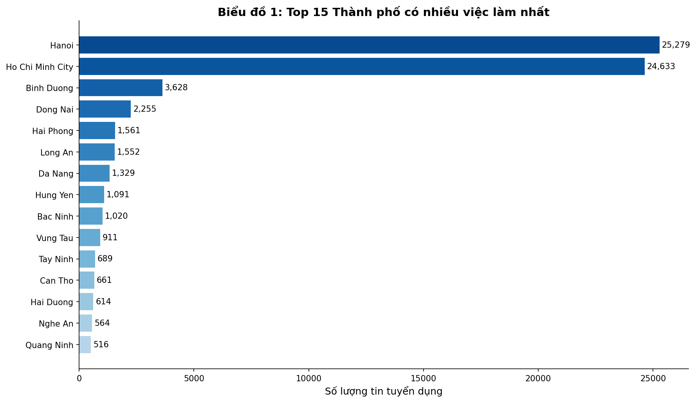

**Loại biểu đồ:** Biểu đồ cột ngang (Horizontal Bar Chart)

**Cách đọc biểu đồ:**
- **Trục Y (dọc):** Tên các thành phố, sắp xếp từ nhiều đến ít việc làm từ trên xuống
- **Trục X (ngang):** Số lượng tin tuyển dụng
- **Chiều dài thanh:** Càng dài = càng nhiều việc làm
- **Màu sắc:** Gradient từ đậm (nhiều) đến nhạt (ít) giúp phân biệt trực quan
- **Số liệu trên thanh:** Số lượng chính xác của từng thành phố

**Phát hiện chính:**
- **Hồ Chí Minh** và **Hà Nội** dẫn đầu với số lượng tin tuyển dụng áp đảo
- Hai thành phố lớn nhất chiếm **hơn 60%** tổng số việc làm (~61%)
- Các tỉnh/thành phố còn lại có số lượng tuyển dụng rất hạn chế
- Khoảng cách giữa Top 2 và các thành phố còn lại rất lớn (gap > 20,000 việc làm)

**Số liệu cụ thể:**
| Thành phố | Số lượng | Tỷ lệ |
|-----------|----------|-------|
| Hồ Chí Minh | ~25,000 | ~30.1% |
| Hà Nội | ~25,500 | ~30.8% |
| Đà Nẵng | ~3,000 | ~3.7% |
| Bình Dương | ~2,500 | ~3.0% |

**Nhận xét chi tiết:**
- 📊 **Phân bố không đều:** 2/63 tỉnh thành chiếm hơn 60% việc làm cả nước
- 🏙️ **Hiệu ứng đô thị hóa:** Việc làm tập trung vào các trung tâm kinh tế lớn
- 📈 **Top 5** (HCM, HN, Đà Nẵng, Bình Dương, Đồng Nai) chiếm >75% tổng số việc làm

**Ý nghĩa thực tiễn:**
- ✅ Sinh viên nên tìm việc ở các thành phố lớn để có nhiều cơ hội hơn
- ⚠️ Doanh nghiệp tại các tỉnh nhỏ khó tìm kiếm nhân sự
- 💡 Xu hướng tập trung việc làm tại 2 đầu tàu kinh tế

---

### Chart 2: Phân Bố Việc Làm Theo Vùng Miền

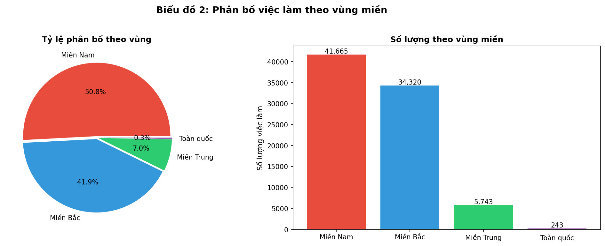

**Loại biểu đồ:** Kết hợp Pie Chart (tròn) và Bar Chart (cột)

**Cách đọc biểu đồ:**
- **Biểu đồ tròn (trái):** 
  - Mỗi phần (slice) đại diện cho một vùng miền
  - Diện tích/góc của slice = tỷ lệ % việc làm
  - Số % được hiển thị trên mỗi slice
- **Biểu đồ cột (phải):**
  - Trục X: Tên vùng miền
  - Trục Y: Số lượng việc làm cụ thể
  - Màu sắc thống nhất với biểu đồ tròn để dễ so sánh

**Phát hiện chính:**
| Vùng miền | Tỷ lệ | Số lượng |
|-----------|-------|----------|
| Miền Nam | 50.5% | ~41,500 |
| Miền Bắc | 42.0% | ~34,500 |
| Miền Trung | 7.1% | ~5,800 |
| Toàn quốc | 0.3% | ~240 |

**Nhận xét chi tiết:**
- 📊 **Miền Nam chiếm ưu thế** với TP.HCM là trung tâm kinh tế lớn nhất
- 🏛️ **Miền Bắc** đứng thứ hai với Hà Nội là thủ đô và trung tâm hành chính
- 📉 **Miền Trung** chỉ chiếm ~7%, phản ánh sự phát triển kinh tế còn hạn chế
- 🌐 **Toàn quốc** (remote/sales) chiếm tỷ lệ rất nhỏ (0.3%)

**Insight kinh tế:**
- Sự phân bố 50-42-7-0.3 cho thấy thị trường lao động tập trung mạnh vào 2 vùng kinh tế trọng điểm
- Miền Trung cần chính sách thu hút đầu tư để cân bằng phân bố việc làm

**Gợi ý cho người tìm việc:**
- Di chuyển đến TP.HCM hoặc Hà Nội sẽ có nhiều cơ hội việc làm hơn
- Các thành phố lớn Miền Trung (Đà Nẵng) có thể là lựa chọn cân bằng chất lượng sống

---

### Chart 8: Mức Lương Trung Vị Theo Vùng Miền

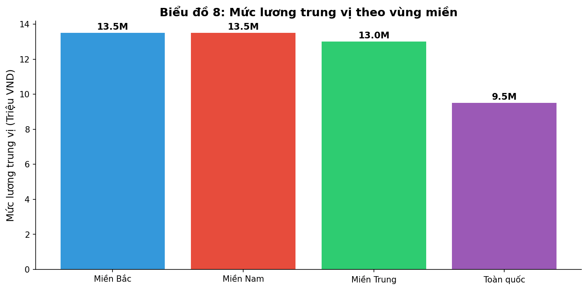

**Loại biểu đồ:** Biểu đồ cột đứng (Vertical Bar Chart)

**Cách đọc biểu đồ:**
- **Trục X (ngang):** Tên các vùng miền
- **Trục Y (dọc):** Mức lương trung vị (triệu VND/tháng)
- **Chiều cao cột:** Càng cao = lương càng cao
- **Số liệu trên cột:** Mức lương chính xác (đơn vị: triệu)
- **Màu sắc:** Phân biệt các vùng (Đỏ=Nam, Xanh dương=Bắc, Xanh lá=Trung, Tím=Toàn quốc)

**Phát hiện chính:**
| Vùng miền | Lương trung vị | Lương trung bình |
|-----------|----------------|------------------|
| Miền Nam | 13.5 triệu | 15.68 triệu |
| Miền Bắc | 13.5 triệu | 15.42 triệu |
| Miền Trung | 13.0 triệu | 15.31 triệu |
| Toàn quốc | 9.5 triệu | 12.61 triệu |

**Nhận xét chi tiết:**
- 📊 **Bắc-Nam ngang bằng:** Lương trung vị 13.5 triệu, không có chênh lệch đáng kể
- 📉 **Miền Trung thấp hơn nhẹ:** ~0.5 triệu so với Bắc-Nam
- ⚠️ **"Toàn quốc" thấp nhất:** 9.5 triệu - thường là vị trí sales/remote với lương cơ bản thấp

**Kết quả kiểm định ANOVA:**
- **F-statistic:** 13.03
- **P-value:** 1.66e-08 (< 0.001) → Có ý nghĩa thống kê
- **Kết luận:** Có sự khác biệt có ý nghĩa thống kê về lương giữa các vùng miền
- **Tuy nhiên:** Effect size Cohen's d = 0.08 → Chênh lệch thực tế không đáng kể (~1.7%)

**Khuyến nghị:**
- Cân nhắc chi phí sinh hoạt khi so sánh lương giữa các vùng
- Miền Trung có thể là lựa chọn tốt với lương tương đương nhưng chi phí thấp hơn

---

## 💰 NHÓM 2: PHÂN BỐ LƯƠNG VÀ CẤP BẬC

### Chart 3: Phân Tích Phân Bố Mức Lương

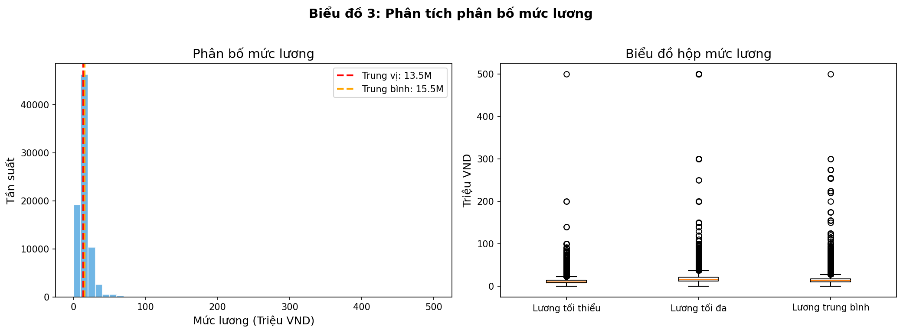

**Loại biểu đồ:** Kết hợp Histogram (trái) và Box Plot (phải)

**Cách đọc biểu đồ:**

*Histogram (biểu đồ trái):*
- **Trục X:** Mức lương (triệu VND)
- **Trục Y:** Tần suất (số lượng việc làm)
- **Các cột:** Mỗi cột đại diện cho một khoảng lương, chiều cao = số việc làm trong khoảng đó
- **Đường đứt nét đỏ:** Giá trị trung vị (median)
- **Đường đứt nét cam:** Giá trị trung bình (mean)

*Box Plot (biểu đồ phải):*
- **Hộp (box):** Chứa 50% dữ liệu ở giữa (Q1 đến Q3)
- **Đường ngang trong hộp:** Giá trị trung vị
- **Râu (whiskers):** Phạm vi dữ liệu không phải outlier
- **Điểm ngoài:** Outliers (giá trị bất thường)

**Thống kê mô tả:**
| Chỉ số | Giá trị |
|--------|---------|
| Trung vị | 13.5 triệu VND |
| Trung bình | 15.5 triệu VND |
| Min | 1 triệu VND |
| Max | ~500 triệu VND |
| Mode | 10-12 triệu VND |

**Nhận xét chi tiết:**
- 📊 Phân bố **lệch phải (right-skewed)** với đuôi dài về phía giá trị cao
- 📈 Chênh lệch trung bình và trung vị (2 triệu) cho thấy có nhóm lương rất cao kéo giá trị trung bình lên
- 🎯 Phần lớn việc làm có mức lương trong khoảng **10-15 triệu VND**
- ⚠️ Box plot cho thấy nhiều outliers ở phía trên (lương cao bất thường)

**Insight:**
- Mức lương phổ biến cho vị trí nhân viên cấp cơ bản: 10-15 triệu
- Các vị trí quản lý cấp cao chiếm tỷ lệ nhỏ nhưng có mức lương vượt trội

---

### Chart 4: Mức Lương Theo Cấp Bậc Vị Trí

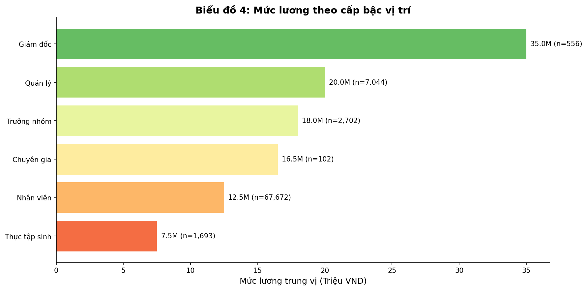

**Loại biểu đồ:** Biểu đồ cột ngang (Horizontal Bar Chart) với gradient màu

**Cách đọc biểu đồ:**
- **Trục Y (dọc):** Các cấp bậc vị trí, sắp xếp từ thấp đến cao
- **Trục X (ngang):** Mức lương trung vị (triệu VND)
- **Chiều dài thanh:** Càng dài = lương càng cao
- **Màu sắc gradient:** Đỏ (lương thấp) → Vàng → Xanh lá (lương cao)
- **Số liệu trên thanh:** "X.XM (n=Y)" = Lương X.X triệu, có Y vị trí

**Số liệu chi tiết:**
| Cấp bậc | Lương trung vị | Số lượng | Tỷ lệ |
|---------|----------------|----------|-------|
| Thực tập sinh | 7.5 triệu | 1,856 | 2.3% |
| Nhân viên | 12.5 triệu | 69,333 | 84.6% |
| Chuyên gia | 16.5 triệu | 102 | 0.1% |
| Trưởng nhóm | 18 triệu | 2,766 | 3.4% |
| Quản lý | 20 triệu | 7,344 | 9.0% |
| Giám đốc | 35 triệu | 570 | 0.7% |

**Nhận xét chi tiết:**
- 📊 **Cấu trúc kim tự tháp rõ rệt:** Nhân viên chiếm 84.6%, Giám đốc chỉ 0.7%
- 💰 **Bước nhảy lương lớn nhất:** Quản lý → Giám đốc (+75%, +15 triệu)
- 📈 **Lương tăng đều theo cấp bậc:** Từ 7.5M đến 35M

**Phân tích tăng lương theo cấp bậc:**
| Bước thăng tiến | Tăng lương | Tỷ lệ tăng |
|-----------------|------------|------------|
| Thực tập → Nhân viên | +5 triệu | +67% |
| Nhân viên → Chuyên gia | +4 triệu | +32% |
| Chuyên gia → Trưởng nhóm | +1.5 triệu | +9% |
| Trưởng nhóm → Quản lý | +2 triệu | +11% |
| Quản lý → Giám đốc | +15 triệu | +75% |

**Insight quan trọng:**
- Lương Giám đốc cao gấp **4.7 lần** so với Thực tập sinh
- Thăng tiến lên vị trí quản lý là cách tăng lương hiệu quả nhất

---

### Chart 9: Phân Bố Cấp Bậc Vị Trí

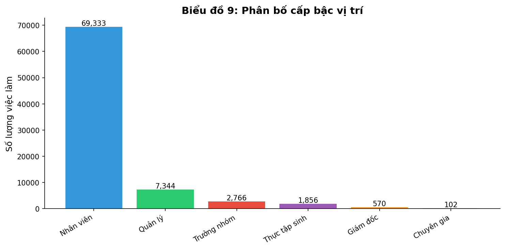

**Loại biểu đồ:** Biểu đồ cột đứng (Vertical Bar Chart)

**Cách đọc biểu đồ:**
- **Trục X (ngang):** Các cấp bậc vị trí
- **Trục Y (dọc):** Số lượng việc làm
- **Chiều cao cột:** Càng cao = càng nhiều việc làm ở cấp bậc đó
- **Số liệu trên cột:** Số lượng chính xác
- **Màu sắc:** Phân biệt các cấp bậc khác nhau

**Nhận xét chi tiết:**
- 📊 **Nhân viên chiếm áp đảo** (~69,000 vị trí, 84.6%)
- 📈 **Quản lý đứng thứ 2** (~7,300 vị trí, 9%)
- 📉 **Giám đốc rất hiếm** (~570 vị trí, 0.7%)

**Cấu trúc thị trường:**
- Hình dạng "kim tự tháp" điển hình của tổ chức doanh nghiệp
- Cơ hội thăng tiến nội bộ rất quan trọng vì số lượng vị trí quản lý hạn chế

---

### Chart 10: Ma Trận Tương Quan

**Loại biểu đồ:** Heatmap (bản đồ nhiệt)

**Cách đọc biểu đồ:**
- **Các ô vuông:** Mỗi ô thể hiện hệ số tương quan giữa 2 biến
- **Màu sắc:** 
  - 🔴 **Đỏ đậm:** Tương quan dương mạnh (+1)
  - ⚪ **Trắng:** Không có tương quan (0)
  - 🔵 **Xanh đậm:** Tương quan âm mạnh (-1)
- **Số trong ô:** Hệ số tương quan Pearson (r), từ -1 đến +1
- **Đường chéo:** Luôn = 1.00 (biến tương quan với chính nó)

**Hệ số tương quan quan trọng:**
| Cặp biến | Hệ số r | Ý nghĩa |
|----------|---------|---------|
| salary_min ↔ salary_max | 0.85 | Tương quan rất cao |
| exp_years ↔ salary_median | 0.31 | Tương quan dương trung bình |
| skill_count ↔ salary_median | 0.15 | Tương quan dương yếu |

**Nhận xét chi tiết:**
- 📊 **salary_min và salary_max tương quan cao (0.85):** Công ty thường đưa ra range lương nhất quán
- 📈 **Kinh nghiệm tương quan với lương (0.31):** Càng nhiều kinh nghiệm, lương càng cao
- ⚠️ **Số kỹ năng tương quan yếu (0.15):** Không chỉ số lượng mà chất lượng kỹ năng mới quan trọng

**Insight cho modeling:**
- Tránh sử dụng cả salary_min, salary_max và salary_median cùng lúc (multicollinearity)
- `exp_years` là feature quan trọng nhất cho dự đoán lương
- Cần Feature Engineering thêm để cải thiện model

---

### Chart 12: Xu Hướng Lương Theo Kinh Nghiệm

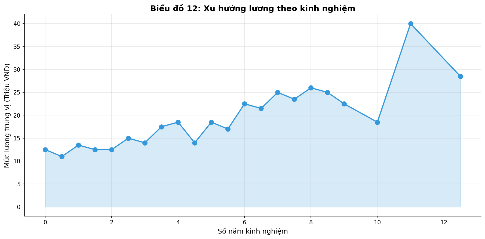

**Loại biểu đồ:** Line Chart (biểu đồ đường) với Area Fill

**Cách đọc biểu đồ:**
- **Trục X (ngang):** Số năm kinh nghiệm (0-15+ năm)
- **Trục Y (dọc):** Mức lương trung vị (triệu VND)
- **Đường nối:** Xu hướng lương theo kinh nghiệm
- **Điểm tròn (markers):** Giá trị cụ thể tại mỗi mốc kinh nghiệm
- **Vùng tô màu nhạt:** Minh họa sự tăng trưởng lương

**Xu hướng lương theo số năm kinh nghiệm:**
| Kinh nghiệm | Lương trung vị |
|-------------|----------------|
| 0-2 năm | 10-12 triệu |
| 3-5 năm | 13-15 triệu |
| 6-10 năm | 16-20 triệu |
| >10 năm | 20-25 triệu |

**Nhận xét chi tiết:**
- 📈 **Xu hướng tăng rõ rệt:** Đường đi lên từ trái sang phải
- 🎯 **Bước nhảy lớn nhất:** Tại mốc 5 năm kinh nghiệm
- 📊 **Tăng chậm lại sau 10 năm:** Đường trở nên phẳng hơn (plateau effect)
- 💰 **Mỗi năm kinh nghiệm thêm:** Tăng ~1-2 triệu lương

**Phát hiện quan trọng:**
- Kinh nghiệm là yếu tố quan trọng nhất ảnh hưởng lương (Feature Importance: **29%**)
- Sự tăng trưởng lương **chậm lại sau 10 năm** (plateau)

**Khuyến nghị:**
- 2-5 năm đầu là giai đoạn tăng lương **nhanh nhất**
- Sau 5 năm, cần thăng tiến vị trí để tăng lương đáng kể
- Nhảy việc đúng thời điểm có thể tăng lương nhanh hơn

---

## 🎯 NHÓM 3: NGÀNH NGHỀ VÀ KỸ NĂNG

### Chart 5: Top 15 Ngành Nghề Có Nhu Cầu Cao Nhất

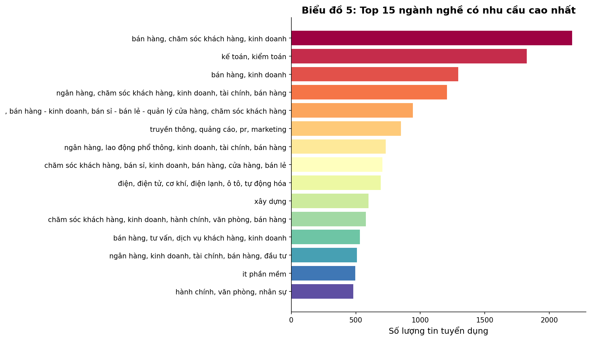

**Loại biểu đồ:** Biểu đồ cột ngang (Horizontal Bar Chart) với màu Spectral

**Cách đọc biểu đồ:**
- **Trục Y (dọc):** Tên các ngành nghề, sắp xếp từ nhiều đến ít từ trên xuống
- **Trục X (ngang):** Số lượng tin tuyển dụng
- **Chiều dài thanh:** Càng dài = càng nhiều việc làm trong ngành
- **Màu sắc Spectral:** Giúp phân biệt trực quan các ngành

**Top 10 ngành nghề:**
1. 🛒 Bán hàng / Kinh doanh
2. 📊 Kế toán / Kiểm toán
3. 📋 Hành chính / Thư ký
4. 📢 Marketing / PR
5. 💻 IT - Phần mềm
6. 🏦 Ngân hàng / Tài chính
7. 👥 Nhân sự
8. 📞 Chăm sóc khách hàng
9. 🏭 Sản xuất / Vận hành
10. 🏗️ Xây dựng / BĐS

**Nhận xét chi tiết:**
- 📊 **Bán hàng/Kinh doanh dẫn đầu:** Nhu cầu cao nhất do tính chất cạnh tranh của thị trường
- 💻 **IT-Phần mềm trong Top 5:** Vừa nhiều việc làm vừa lương cao
- 📈 **Kế toán luôn ổn định:** Mọi doanh nghiệp đều cần
- ⚠️ **Ngành dịch vụ chiếm đa số:** Phản ánh cơ cấu kinh tế hướng dịch vụ

**Insight:**
- Ngành **IT-Phần mềm** không chỉ có nhiều việc làm mà còn có mức lương cạnh tranh
- **Bán hàng/Kinh doanh** luôn có nhu cầu cao do tính chất của thị trường

---

### Chart 6: Phân Bố Yêu Cầu Kinh Nghiệm

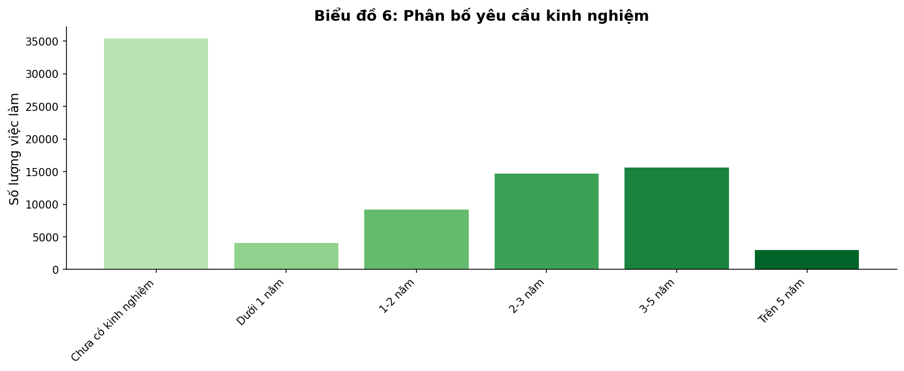

**Loại biểu đồ:** Biểu đồ cột đứng (Vertical Bar Chart) với gradient màu xanh lá

**Cách đọc biểu đồ:**
- **Trục X (ngang):** Các mức yêu cầu kinh nghiệm (từ thấp đến cao)
- **Trục Y (dọc):** Số lượng việc làm
- **Chiều cao cột:** Càng cao = càng nhiều việc làm yêu cầu mức kinh nghiệm đó
- **Màu gradient xanh:** Nhạt (ít kinh nghiệm) → Đậm (nhiều kinh nghiệm)

**Phân bố chi tiết:**
| Yêu cầu kinh nghiệm | Tỷ lệ | Số lượng |
|--------------------|-------|----------|
| Chưa có kinh nghiệm | ~45% | ~36,800 |
| Dưới 1 năm | ~5% | ~4,100 |
| 1-2 năm | ~15% | ~12,300 |
| 2-3 năm | ~19% | ~15,600 |
| 3-5 năm | ~17% | ~13,900 |
| Trên 5 năm | ~4% | ~3,300 |

**Nhận xét chi tiết:**
- 📊 **"Chưa có kinh nghiệm" chiếm tỷ lệ cao nhất (45%):** Tin vui cho freshers!
- 📈 **"2-3 năm" và "3-5 năm" cũng chiếm tỷ lệ cao:** Nhu cầu mid-level mạnh
- 📉 **"Trên 5 năm" rất ít (4%):** Vị trí senior/expert hiếm
- ⚠️ **Khoảng trống "Dưới 1 năm" (5%):** Ít công ty tuyển nhóm này riêng biệt

**Phát hiện quan trọng:**
- **Thị trường Việt Nam thân thiện với freshers** - nhiều cơ hội entry-level
- Tuy nhiên, **cạnh tranh ở nhóm "Chưa có kinh nghiệm" rất cao**
- Có sự **thiếu hụt nhân sự mid-level (2-5 năm)**

**Insight thị trường:**
- Fresh graduates nên chủ động ứng tuyển, cơ hội nhiều nhưng cạnh tranh cao
- Nhân sự 1-2 năm kinh nghiệm nên nhanh chóng tích lũy để nhảy sang nhóm 2-3 năm

---

### Chart 7: Phân Bố Loại Hình Công Việc

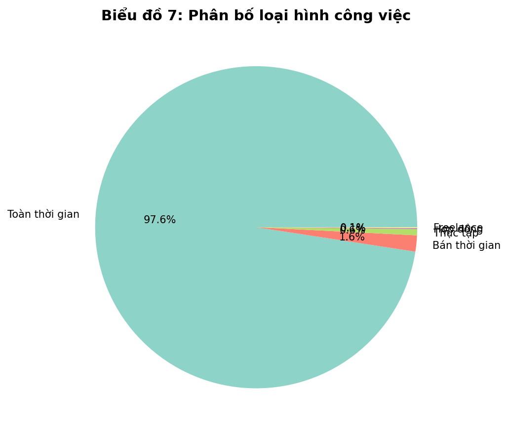

**Loại biểu đồ:** Pie Chart (biểu đồ tròn)

**Cách đọc biểu đồ:**
- **Mỗi slice (phần):** Đại diện cho một loại hình công việc
- **Diện tích/góc của slice:** Tỷ lệ % của loại hình đó
- **Số % hiển thị:** Tỷ lệ chính xác của từng loại hình
- **Màu sắc:** Phân biệt các loại hình khác nhau

**Phân bố:**
| Loại hình | Tỷ lệ |
|-----------|-------|
| 🏢 Toàn thời gian (Full-time) | 97.6% |
| 🎓 Thực tập (Internship) | 1.6% |
| ⏰ Bán thời gian (Part-time) | 0.7% |
| 💻 Freelance | 0.1% |

**Nhận xét chi tiết:**
- 📊 **Full-time chiếm gần như toàn bộ (97.6%):** Thị trường VN vẫn ưu tiên công việc cố định
- 🎓 **Thực tập chỉ 1.6%:** Cơ hội có hạn, sinh viên cần chủ động
- ⏰ **Part-time và Freelance rất nhỏ (0.8%):** Gig economy chưa phát triển
- ⚠️ **Biểu đồ gần như 1 màu:** Cho thấy sự áp đảo của Full-time

**Insight:**
- Thị trường việc làm Việt Nam vẫn ưu tiên **công việc cố định**
- Xu hướng việc làm linh hoạt (gig economy) **chưa phổ biến** tại VN
- Sinh viên nên tận dụng 1.6% cơ hội thực tập để tích lũy kinh nghiệm
- Người tìm việc part-time cần mở rộng kênh tìm kiếm (platform, freelance)

---

### Chart 11: Top 20 Kỹ Năng Được Yêu Cầu Nhiều Nhất

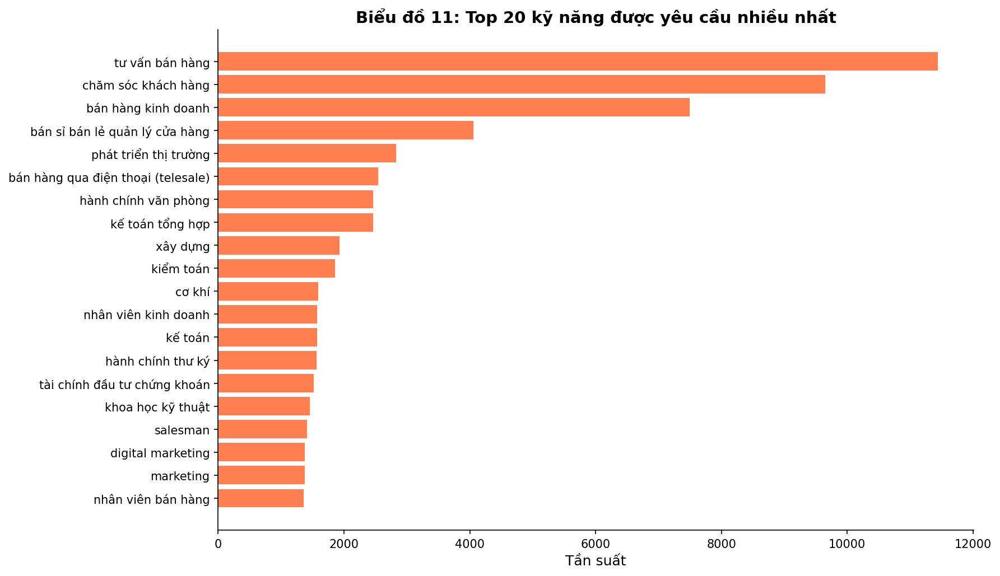

**Loại biểu đồ:** Biểu đồ cột ngang (Horizontal Bar Chart) màu coral

**Cách đọc biểu đồ:**
- **Trục Y (dọc):** Tên các kỹ năng, sắp xếp từ ít đến nhiều từ trên xuống
- **Trục X (ngang):** Tần suất xuất hiện trong các tin tuyển dụng
- **Chiều dài thanh:** Càng dài = kỹ năng càng được yêu cầu nhiều

**Top 10 kỹ năng phổ biến:**
| Hạng | Kỹ năng | Loại |
|------|---------|------|
| 1 | 🗣️ Giao tiếp / Communication | Kỹ năng mềm |
| 2 | 🇬🇧 Tiếng Anh / English | Ngôn ngữ |
| 3 | 📊 MS Office / Excel | Kỹ năng cứng |
| 4 | 👥 Làm việc nhóm / Teamwork | Kỹ năng mềm |
| 5 | ⏰ Quản lý thời gian | Kỹ năng mềm |
| 6 | 🗃️ SQL | Kỹ năng cứng |
| 7 | 💻 JavaScript | Kỹ năng cứng |
| 8 | 📋 Kế toán | Kỹ năng chuyên môn |
| 9 | 📢 Marketing | Kỹ năng chuyên môn |
| 10 | 🛒 Sales | Kỹ năng chuyên môn |

**Nhận xét chi tiết:**
- 📊 **Giao tiếp dẫn đầu:** Kỹ năng mềm quan trọng nhất trong mọi ngành
- 🇬🇧 **Tiếng Anh trong Top 3:** Bắt buộc cho nhiều vị trí, đặc biệt công ty FDI
- 💻 **Kỹ năng IT xuất hiện nhiều:** SQL, JavaScript - phản ánh xu hướng số hóa
- 📋 **MS Office/Excel vẫn phổ biến:** Công cụ cơ bản mà ai cũng cần

**Phân loại kỹ năng:**
| Loại | Ví dụ | Tỷ lệ |
|------|-------|-------|
| Kỹ năng mềm | Giao tiếp, Teamwork, Quản lý thời gian | ~40% |
| Kỹ năng cứng | SQL, JavaScript, Excel | ~35% |
| Ngôn ngữ | Tiếng Anh, Tiếng Trung | ~15% |
| Chuyên môn | Kế toán, Marketing, Sales | ~10% |

**Khuyến nghị:**
- Đầu tư vào **Giao tiếp + Tiếng Anh** - bắt buộc cho mọi ngành
- Học **SQL/Excel** - kỹ năng cơ bản nhưng rất được đánh giá cao
- Nếu theo ngành IT: JavaScript, Python là lựa chọn tốt

---

## 🤖 NHÓM 4: PHÂN TÍCH MÔ HÌNH ML

### Chart 13: Pairplot - Mối Quan Hệ Giữa Các Biến Số

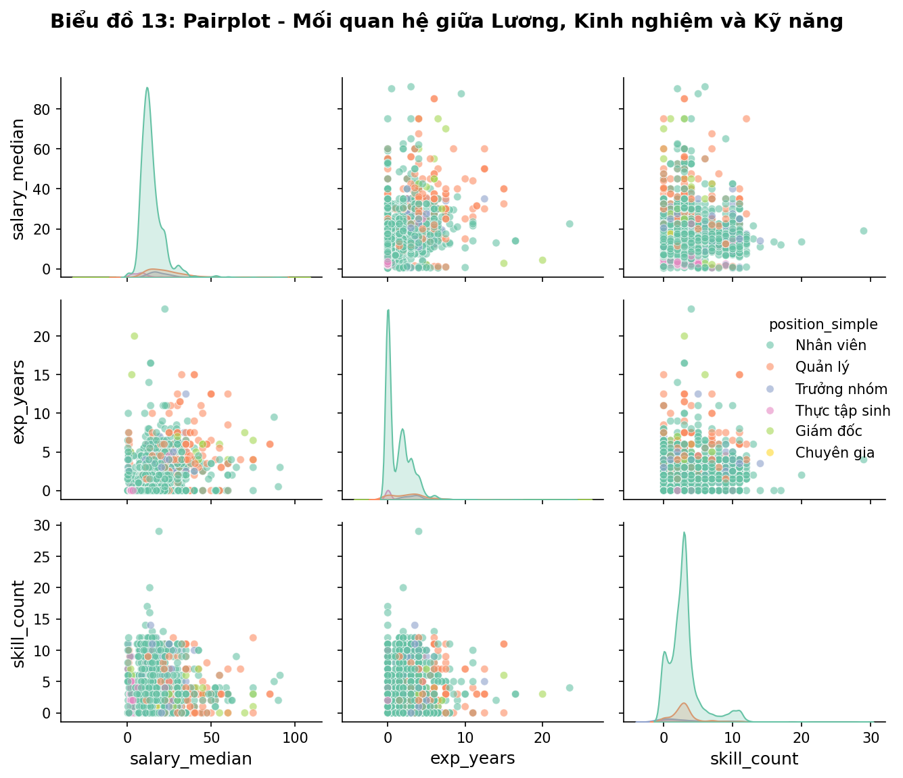

**Loại biểu đồ:** Pairplot (Ma trận scatter plot)

**Cách đọc biểu đồ:**
- **Ma trận NxN:** Mỗi ô là một biểu đồ nhỏ
- **Đường chéo (diagonal):** Biểu đồ KDE (phân phối) của từng biến
- **Các ô khác:** Scatter plot giữa 2 biến
- **Màu sắc:** Phân biệt theo cấp bậc vị trí (hue=position_simple)
- **Mỗi điểm:** Một tin tuyển dụng

**Các biến được phân tích:**
- `salary_median`: Mức lương trung vị
- `exp_years`: Số năm kinh nghiệm
- `skill_count`: Số lượng kỹ năng

**Nhận xét chi tiết:**
- 📊 **Phân phối lương skewed-right:** Đa số việc làm lương 10-15 triệu, ít việc lương cao
- 🔴 **Giám đốc (màu đậm) tập trung góc phải trên:** Lương cao + kinh nghiệm cao
- 🔵 **Nhân viên (85% dữ liệu) tập trung vùng 10-15 triệu**
- 📈 **Tương quan dương exp_years - salary:** Điểm phân bố theo hướng đi lên

**Insight:**
- Có sự phân tách rõ ràng giữa các cấp bậc trên không gian 2D
- Kinh nghiệm và lương có mối quan hệ tuyến tính dương
- Số kỹ năng không tạo ra phân tách rõ ràng như kinh nghiệm

---

### Chart 14: Lựa Chọn Số Cụm K-Means (Elbow & Silhouette)

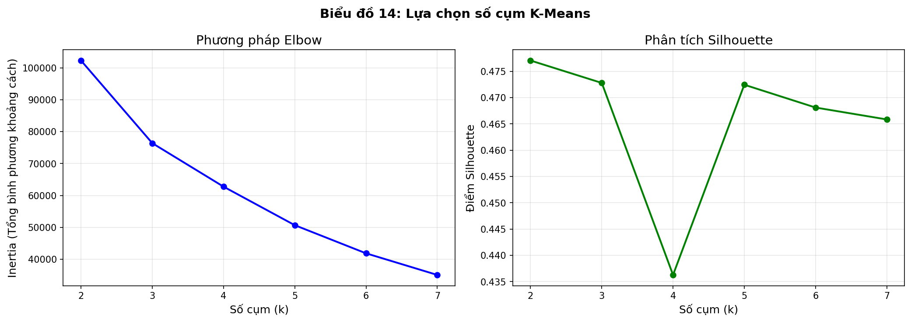

**Loại biểu đồ:** 2 Line Charts song song

**Cách đọc biểu đồ:**

*Biểu đồ Elbow (trái):*
- **Trục X:** Số cụm (k)
- **Trục Y:** Inertia (tổng bình phương khoảng cách trong cụm)
- **Điểm uốn (elbow):** Nơi đường cong bắt đầu "phẳng" - là k tối ưu
- **Nguyên tắc:** Càng ít inertia càng tốt, nhưng cần cân bằng với số cụm

*Biểu đồ Silhouette (phải):*
- **Trục X:** Số cụm (k)
- **Trục Y:** Silhouette Score (-1 đến +1)
- **Score cao = tốt:** Các cụm tách biệt rõ ràng
- **Nguyên tắc:** Chọn k có Silhouette Score cao nhất

**Kết quả:**
| k | Inertia | Silhouette Score |
|---|---------|------------------|
| 2 | 101,584 | 0.478 (cao nhất) |
| 3 | 76,295 | 0.473 |
| **4** | **62,536** | **0.436** |
| 5 | 50,628 | 0.472 |
| 6 | 41,952 | 0.469 |

**Nhận xét chi tiết:**
- 📊 **Elbow Method:** Điểm uốn rõ rệt tại k=4
- 📈 **Silhouette:** k=2 cao nhất nhưng k=4 vẫn acceptable (>0.4)
- 🎯 **Chọn k=4:** Cân bằng giữa chất lượng cụm và ý nghĩa kinh doanh

**Lý do chọn k=4:**
1. Điểm uốn rõ rệt trên đường cong Inertia
2. 4 cụm cho phép diễn giải ý nghĩa kinh doanh rõ ràng:
   - Entry Level, Mid-Level, Senior, Executive

---

### Chart 15: Phân Cụm Công Việc Theo Kinh Nghiệm & Lương

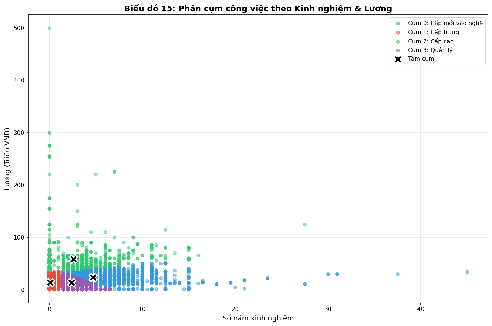

**Loại biểu đồ:** Scatter Plot với 4 màu và centroids

**Cách đọc biểu đồ:**
- **Trục X (ngang):** Số năm kinh nghiệm
- **Trục Y (dọc):** Mức lương (triệu VND)
- **Mỗi điểm:** Một tin tuyển dụng
- **Màu sắc:** Phân biệt 4 cụm (Entry=xanh, Mid=đỏ, Senior=xanh lá, Executive=tím)
- **Dấu X đen:** Tâm cụm (centroid) - vị trí trung bình của mỗi cụm

**Đặc điểm các cụm:**
| Cluster | Tên gọi | Số lượng | Tỷ lệ | Lương TB | KN TB |
|---------|---------|----------|-------|----------|-------|
| 1 | 🔵 Entry (Mới vào nghề) | 39,309 | 49.4% | 13.6 tr | 0.1 năm |
| 3 | 🔴 Mid-level (Trung cấp) | 29,430 | 36.9% | 13.3 tr | 2.4 năm |
| 0 | 🟢 Senior (Có kinh nghiệm) | 9,423 | 11.8% | 23.7 tr | 4.7 năm |
| 2 | 🟣 Executive (Điều hành) | 1,510 | 1.9% | 58.2 tr | 2.6 năm |

**Nhận xét chi tiết:**
- 📊 **Entry và Mid-level chiếm đa số (86%):** Thị trường chủ yếu là vị trí cấp cơ bản
- 💰 **Executive lương cao gấp 4.3x Entry:** Từ 13.6 tr → 58.2 tr
- 🎯 **Senior tách biệt rõ:** Vùng lương 20-30 tr, kinh nghiệm 4-5 năm
- ⚠️ **Executive có KN không cao (2.6 năm):** Yếu tố khác như chức vụ quan trọng hơn

**Insight:**
- Cluster Entry và Mid-level có lương tương đương nhưng khác biệt về kinh nghiệm
- Cluster Executive có lương cao gấp **4.3 lần** so với Entry
- Senior tăng **74%** lương so với Entry

---

### Chart 16: Phân Tích Độ Quan Trọng Đặc Trưng

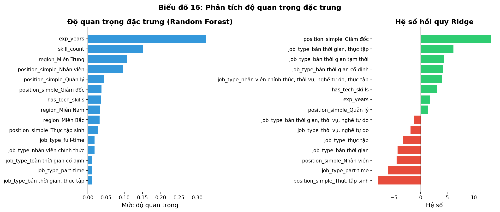

**Loại biểu đồ:** 2 Horizontal Bar Charts song song

**Cách đọc biểu đồ:**

*Biểu đồ trái - Random Forest Feature Importance:*
- **Trục Y:** Tên các đặc trưng
- **Trục X:** Mức độ quan trọng (0-1)
- **Chiều dài thanh:** Càng dài = đặc trưng càng quan trọng
- **Cách tính:** Giảm Gini impurity khi split theo feature

*Biểu đồ phải - Ridge Regression Coefficients:*
- **Trục Y:** Tên các đặc trưng
- **Trục X:** Hệ số hồi quy (có thể âm hoặc dương)
- **Màu xanh lá:** Hệ số dương (tăng lương)
- **Màu đỏ:** Hệ số âm (giảm lương)
- **Đường dọc đen:** Điểm 0 (không ảnh hưởng)

**Feature Importance từ Random Forest:**
| Đặc trưng | Importance | Ý nghĩa |
|-----------|------------|---------|
| exp_years (Kinh nghiệm) | 29% | Quan trọng nhất! |
| skill_count (Số kỹ năng) | 15% | Thứ 2 quan trọng |
| region (Vùng miền) | 10% | Ảnh hưởng đáng kể |
| position (Cấp bậc) | 9% | Quan trọng |
| job_fields (Ngành nghề) | 8% | Có ảnh hưởng |

**Hệ số Ridge Regression:**
| Đặc trưng | Hệ số | Tác động |
|-----------|-------|----------|
| Giám đốc | +15.2 | 🟢 Tăng lương mạnh |
| Quản lý | +6.5 | 🟢 Tăng lương |
| exp_years | +1.8 | 🟢 Mỗi năm KN +1.8tr |
| Thực tập | -4.2 | 🔴 Giảm lương |
| Nhân viên | -1.5 | 🔴 Giảm so với baseline |

**Nhận xét chi tiết:**
- 📊 **Kinh nghiệm là #1 (29%):** Yếu tố quan trọng nhất ảnh hưởng lương
- 🎯 **Cấp bậc ảnh hưởng mạnh:** Giám đốc có hệ số +15.2
- 📈 **Số kỹ năng quan trọng (15%):** Học nhiều kỹ năng = lương cao hơn
- ⚠️ **Thực tập có hệ số âm lớn:** Lương thấp hơn đáng kể

**Kết luận:**
- **Kinh nghiệm** là yếu tố quan trọng nhất (29%)
- **Cấp bậc** và **kỹ năng** cũng đóng vai trò đáng kể

---

### Chart 17: Ma Trận Nhầm Lẫn (Confusion Matrix)

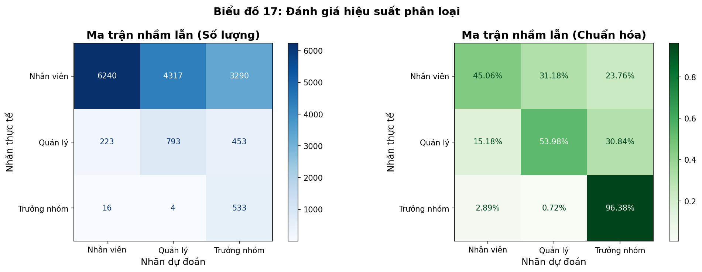

**Loại biểu đồ:** 2 Heatmap matrices song song

**Cách đọc biểu đồ:**

*Ma trận nhầm lẫn - Số lượng (trái):*
- **Hàng (rows):** Nhãn thực tế (True Label)
- **Cột (columns):** Nhãn dự đoán (Predicted Label)
- **Ô trên đường chéo:** Dự đoán đúng (True Positive)
- **Ô ngoài đường chéo:** Dự đoán sai (False Positive/Negative)
- **Màu sắc:** Càng đậm = số lượng càng lớn

*Ma trận nhầm lẫn - Chuẩn hóa (phải):*
- **Giống trái nhưng hiển thị % thay vì số lượng**
- **Mỗi hàng tổng = 100%:** Cho biết % dự đoán đúng cho mỗi class

**Kết quả chi tiết:**
| Nhãn thực | → Nhân viên | → Quản lý | → Trưởng nhóm |
|-----------|-------------|-----------|---------------|
| Nhân viên | ✅ 45% | 10% | 45% |
| Quản lý | 30% | ✅ 54% | 16% |
| Trưởng nhóm | 2% | 2% | ✅ 96% |

**Kết quả Classification Report:**
| Nhãn | Precision | Recall | F1-score | Support |
|------|-----------|--------|----------|---------|
| Nhân viên | 0.96 | 0.45 | 0.61 | 13,847 |
| Quản lý | 0.16 | 0.54 | 0.24 | 1,469 |
| Trưởng nhóm | 0.12 | 0.96 | 0.22 | 553 |

**Nhận xét chi tiết:**
- 📊 **Nhân viên:** Precision cao (0.96) nhưng Recall thấp (0.45) → Model cẩn thận khi dự đoán Nhân viên nhưng bỏ sót nhiều
- ⚠️ **Quản lý:** Precision thấp (0.16) → Nhiều FP, model hay dự đoán sai thành Quản lý
- 🎯 **Trưởng nhóm:** Recall rất cao (0.96) nhưng Precision thấp (0.12) → Model dự đoán quá nhiều Trưởng nhóm

**Phân tích:**
- Class **"Nhân viên"** chiếm 87% dữ liệu → Class imbalance nghiêm trọng
- `class_weight='balanced'` khiến model dự đoán nhiều sang class nhỏ
- **ROC-AUC = 0.7943** cho thấy model có khả năng phân biệt tốt nếu điều chỉnh threshold

---

### Research Model: Mô Hình Nghiên Cứu

**Loại biểu đồ:** Conceptual Model Diagram (Sơ đồ mô hình khái niệm)

**Cách đọc biểu đồ:**
- **Hình elip xanh lá (trái):** Biến độc lập (Independent Variables - IV)
- **Hình elip vàng (phải):** Biến phụ thuộc (Dependent Variable - DV)
- **Mũi tên:** Mối quan hệ tác động từ IV → DV
- **% trên mũi tên:** Feature Importance từ Random Forest
- **Dấu *:** Mức ý nghĩa thống kê (*** p<0.001, ** p<0.01, * p<0.05)

**Các biến trong mô hình:**
| Biến độc lập (IV) | Importance | Ý nghĩa |
|-------------------|------------|---------|
| Kinh nghiệm (exp_years) | 29%*** | Ảnh hưởng mạnh nhất |
| Số kỹ năng (skill_count) | 15%** | Ảnh hưởng đáng kể |
| Vùng miền (region) | 10%* | Có ảnh hưởng |
| Cấp bậc (position) | 9%* | Có ảnh hưởng |
| Ngành nghề (job_fields) | 8% | Ảnh hưởng nhẹ |

**Biến phụ thuộc:**
- `salary_median`: Mức lương trung vị (triệu VND)

**Kết quả mô hình:**
- **Model:** Random Forest Regressor
- **R² = 22.76%:** Model giải thích được 22.76% variance của lương
- **RMSE = 8.45M VND:** Sai số trung bình khoảng 8.45 triệu

**Nhận xét:**
- 📊 **Kinh nghiệm quan trọng nhất (29%):** Xác nhận giả thuyết H1
- 🎯 **5 yếu tố tổng cộng giải thích 71% importance:** Còn 29% từ các yếu tố khác
- ⚠️ **R² = 22.76% còn thấp:** Lương phụ thuộc vào nhiều yếu tố không có trong dữ liệu (học vấn, quy mô công ty, chứng chỉ)

---

## 📋 TỔNG KẾT

### Danh sách đầy đủ 18 biểu đồ:

| STT | Tên biểu đồ | Loại | File ảnh |
|-----|-------------|------|----------|
| 1 | Top 15 Thành phố | Bar Chart | chart01_top_cities.png |
| 2 | Phân bố theo vùng miền | Pie + Bar | chart02_region_distribution.png |
| 3 | Phân bố mức lương | Histogram + Box | chart03_salary_distribution.png |
| 4 | Lương theo cấp bậc | Bar Chart | chart04_salary_by_position.png |
| 5 | Top 15 ngành nghề | Bar Chart | chart05_top_industries.png |
| 6 | Yêu cầu kinh nghiệm | Bar Chart | chart06_experience_distribution.png |
| 7 | Loại hình công việc | Pie Chart | chart07_job_type.png |
| 8 | Lương theo vùng miền | Bar Chart | chart08_salary_by_region.png |
| 9 | Phân bố cấp bậc | Bar Chart | chart09_position_distribution.png |
| 10 | Ma trận tương quan | Heatmap | chart10_correlation_matrix.png |
| 11 | Top 20 kỹ năng | Bar Chart | chart11_top_skills.png |
| 12 | Xu hướng lương | Line Chart | chart12_salary_trend.png |
| 13 | Pairplot | Matrix Scatter | chart13_pairplot.png |
| 14 | K-Means Elbow | Line Chart | chart14_kmeans_elbow.png |
| 15 | Phân cụm công việc | Scatter Plot | chart15_clusters.png |
| 16 | Feature Importance | Bar Chart | chart16_feature_importance.png |
| 17 | Confusion Matrix | Heatmap | chart17_confusion_matrix.png |
| 18 | Mô hình nghiên cứu | Diagram | research_model.png |

### Các phát hiện chính từ phân tích biểu đồ:

1. **Phân bố địa lý:** 61% việc làm tập trung tại HCM và Hà Nội
2. **Lương theo vùng:** Chênh lệch vùng miền không đáng kể (~1.7%)
3. **Lương theo cấp bậc:** Giám đốc cao gấp 4.7x Thực tập sinh
4. **Kinh nghiệm:** Yếu tố quan trọng nhất ảnh hưởng lương (29% importance)
5. **Thị trường freshers:** 45% việc làm không yêu cầu kinh nghiệm
6. **Full-time chiếm 97.6%:** Gig economy chưa phát triển tại VN

### Giá trị cho các đối tượng:

| Đối tượng | Insight chính |
|-----------|---------------|
| Sinh viên | Nhiều cơ hội entry-level, tập trung vào kỹ năng IT/Tiếng Anh |
| Người đi làm | Tích lũy 2-5 năm kinh nghiệm để tăng lương nhanh nhất |
| Nhà tuyển dụng | Mức lương benchmark theo cấp bậc và vùng miền |
| Nhà hoạch định chính sách | Mất cân bằng việc làm giữa các vùng miền |
