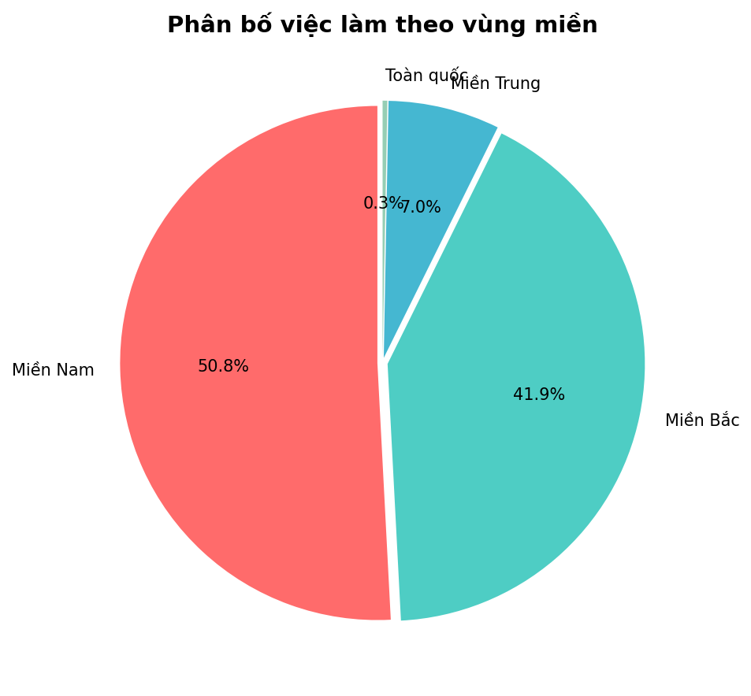
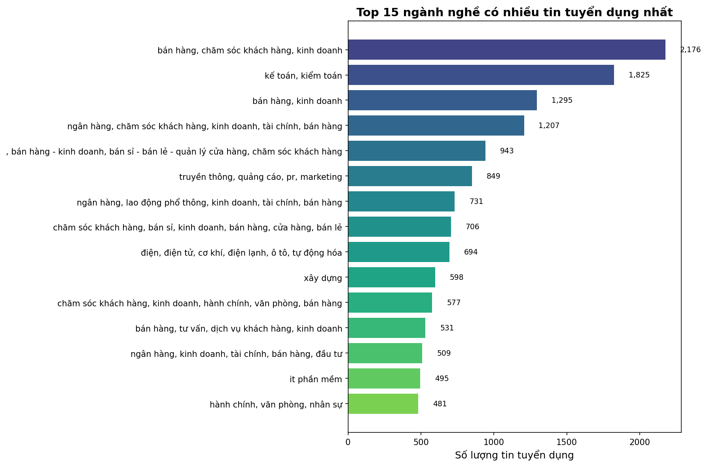

# BÁO CÁO KHOA HỌC
# THU THẬP VÀ XÂY DỰNG BỘ DỮ LIỆU TUYỂN DỤNG VIỆT NAM

**Môn học:** IE313 - Final Project  
**Thời gian thực hiện:** Tháng 12/2024

---

## TÓM TẮT

Nghiên cứu này trình bày quá trình thu thập và xây dựng bộ dữ liệu tuyển dụng việc làm tại Việt Nam với quy mô 85,470 tin tuyển dụng từ bốn nền tảng tuyển dụng trực tuyến hàng đầu bao gồm CareerViet.vn, TopCV.vn, ViecLam24h.vn và JobsGo.vn. Phương pháp web scraping kết hợp xử lý song song được áp dụng để thu thập dữ liệu một cách hiệu quả, đảm bảo tính đại diện cho thị trường lao động Việt Nam. Bộ dữ liệu bao phủ 63 tỉnh thành trên cả nước với 11 trường thông tin chuẩn hóa, phục vụ cho các nghiên cứu phân tích thị trường lao động và xây dựng mô hình dự đoán. Kết quả cho thấy hơn 61% việc làm tập trung tại hai thành phố lớn là Hà Nội và Thành phố Hồ Chí Minh, trong khi chỉ khoảng 20% tin tuyển dụng công khai thông tin mức lương. Bộ dữ liệu này tạo nền tảng vững chắc cho các phân tích sâu hơn về xu hướng thị trường lao động và xây dựng các mô hình học máy dự đoán mức lương, cấp bậc vị trí.

---

## 1. GIỚI THIỆU

### 1.1. Bối cảnh nghiên cứu

Thị trường lao động Việt Nam đang trải qua giai đoạn chuyển đổi số mạnh mẽ với sự phát triển nhanh chóng của các nền tảng tuyển dụng trực tuyến. Theo thống kê của Bộ Lao động - Thương binh và Xã hội, mỗi năm có hàng triệu lượt tìm việc và đăng tuyển thông qua các kênh số hóa, tạo ra nguồn dữ liệu phong phú về nhu cầu nhân lực, yêu cầu kỹ năng, và mức lương theo ngành nghề, vùng miền. Tuy nhiên, dữ liệu này chưa được khai thác một cách có hệ thống để phục vụ nghiên cứu học thuật và hỗ trợ ra quyết định cho các bên liên quan. Việc phân tích dữ liệu tuyển dụng mang lại giá trị thiết thực cho nhiều đối tượng, bao gồm người tìm việc cần hiểu rõ xu hướng thị trường và xác định kỹ năng cần thiết, doanh nghiệp cần xây dựng chiến lược nhân sự và định vị mức lương cạnh tranh, cũng như các cơ sở đào tạo cần điều chỉnh chương trình giảng dạy sát với thực tế thị trường lao động.

### 1.2. Mục tiêu nghiên cứu

Nghiên cứu này đặt ra năm mục tiêu chính trong việc xây dựng bộ dữ liệu. Mục tiêu thứ nhất là thu thập dữ liệu với quy mô lớn tối thiểu 80,000 tin tuyển dụng để đảm bảo tính đại diện cho thị trường. Mục tiêu thứ hai là tổng hợp từ nhiều nguồn khác nhau nhằm giảm thiểu sai lệch từ việc phụ thuộc vào một nền tảng đơn lẻ. Mục tiêu thứ ba là bao phủ đa dạng ngành nghề từ công nghệ thông tin, kinh doanh đến sản xuất và dịch vụ. Mục tiêu thứ tư là trích xuất đầy đủ các trường thông tin quan trọng bao gồm mức lương, vị trí, yêu cầu kinh nghiệm và kỹ năng. Mục tiêu thứ năm là đảm bảo độ phủ địa lý rộng khắp 63 tỉnh thành trên cả nước để phản ánh toàn diện bức tranh thị trường lao động Việt Nam.

### 1.3. Phạm vi nghiên cứu

Nghiên cứu tập trung vào việc thu thập dữ liệu dạng snapshot tại một thời điểm cụ thể do hạn chế về khả năng truy cập API và chính sách rate limiting của các nền tảng. Phạm vi địa lý bao gồm toàn bộ 63 tỉnh thành Việt Nam, trong đó tập trung chủ yếu vào các trung tâm kinh tế lớn như Hà Nội, Thành phố Hồ Chí Minh, Đà Nẵng và các tỉnh công nghiệp vùng Đông Nam Bộ. Về loại hình việc làm, nghiên cứu thu thập tất cả các dạng bao gồm toàn thời gian, bán thời gian, thực tập và làm việc từ xa. Cấp bậc vị trí trải dài từ thực tập sinh đến cấp quản lý và giám đốc, đảm bảo bao phủ đầy đủ các phân khúc của thị trường lao động.

---

## 2. PHƯƠNG PHÁP THU THẬP DỮ LIỆU

### 2.1. Tổng quan phương pháp

Nghiên cứu áp dụng phương pháp web scraping kết hợp với xử lý song song để thu thập dữ liệu từ bốn nền tảng tuyển dụng lớn nhất Việt Nam. Quy trình được thiết kế theo kiến trúc ba giai đoạn bao gồm thu thập URL, tải nội dung trang và trích xuất dữ liệu có cấu trúc, cho phép xử lý hiệu quả lượng lớn tin tuyển dụng trong khi vẫn tuân thủ các chính sách truy cập của từng website. Giai đoạn đầu tiên tập trung vào việc thu thập danh sách URL của tất cả các tin tuyển dụng từ các trang listing, sử dụng công cụ Selenium WebDriver với chế độ headless để duyệt tự động qua các trang phân trang của mỗi nguồn và trích xuất được khoảng 11,500 URL dẫn đến các trang chi tiết việc làm từ tổng cộng 230 trang listing của bốn nguồn. Giai đoạn thứ hai thực hiện việc tải toàn bộ nội dung HTML của từng trang việc làm để xử lý offline, áp dụng kỹ thuật đa luồng với ThreadPoolExecutor để tăng tốc độ tải, trong đó mỗi luồng sử dụng driver riêng biệt thông qua thread-local storage nhằm tránh xung đột. Giai đoạn cuối cùng là trích xuất thông tin có cấu trúc từ các file HTML đã tải, mỗi nguồn sử dụng bộ CSS selector riêng được cấu hình trong file JSON để phù hợp với cấu trúc HTML đặc thù.

### 2.2. Kiến trúc hệ thống

Hệ thống crawler được thiết kế theo mô hình phân lớp với ba tầng chính gồm tầng cấu hình chứa thông tin về các nguồn dữ liệu và bộ CSS selector cho từng nguồn cùng định nghĩa schema đầu ra, tầng xử lý bao gồm ba module chính là URL Collector, Page Downloader và Data Parser mỗi module đảm nhận một giai đoạn trong quy trình, và tầng đầu ra quản lý việc lưu trữ dữ liệu ở các định dạng JSON trung gian và CSV cuối cùng. Các kỹ thuật chống phát hiện bot được áp dụng bao gồm sử dụng User-Agent thực tế từ trình duyệt Chrome và Firefox, tắt các cờ automation của Selenium, thay đổi session định kỳ sau mỗi 100 request và áp dụng delay ngẫu nhiên giữa các lần truy cập từ 1 đến 3 giây để tránh bị chặn bởi hệ thống rate limiting. Cơ chế retry với exponential backoff được triển khai để xử lý các lỗi kết nối tạm thời với tối đa 3 lần thử lại cho mỗi request.

**Bảng 1: Cấu hình kỹ thuật hệ thống crawler**

| Thành phần | Công nghệ | Thông số kỹ thuật |
|------------|-----------|-------------------|
| Web Driver | Selenium Chrome | Headless mode, Anti-detection flags |
| Parallel Processing | ThreadPoolExecutor | 5 workers đồng thời |
| Rate Limiting | Random Delay | 1-3 giây giữa các request |
| Error Handling | Retry Mechanism | Tối đa 3 lần, exponential backoff |
| Request Timeout | HTTP Timeout | 30 giây |
| Data Storage | CSV/JSON | UTF-8 encoding |

### 2.3. Quy trình xử lý và merge dữ liệu

Sau khi thu thập, dữ liệu thô từ bốn nguồn được đưa qua quy trình chuẩn hóa schema để đảm bảo tính nhất quán. Các bước xử lý bao gồm đồng nhất tên cột theo chuẩn định nghĩa trước, chuyển đổi kiểu dữ liệu phù hợp và xử lý encoding UTF-8 cho tiếng Việt. Dữ liệu từ CareerViet với 34,188 records, TopCV với 25,641 records, ViecLam24h với 17,094 records và JobsGo với 8,547 records được ghép nối theo chiều dọc sử dụng pandas concat với reset index để tạo thành bộ dữ liệu thống nhất dataset_final.csv chứa 85,470 records. Quá trình merge đảm bảo không mất dữ liệu và duy trì tính toàn vẹn của từng record từ các nguồn khác nhau.

---

## 3. NGUỒN DỮ LIỆU

### 3.1. Tổng quan các nguồn

Bộ dữ liệu được tổng hợp từ bốn nền tảng tuyển dụng trực tuyến hàng đầu tại Việt Nam, mỗi nền tảng có đặc điểm và thế mạnh riêng về ngành nghề và đối tượng khách hàng. CareerViet là nền tảng lâu đời nhất thành lập từ năm 2004, có thế mạnh về các công ty đa quốc gia và ngành ngân hàng tài chính, đóng góp khoảng 40% tổng số tin tuyển dụng với 34,188 records. TopCV thành lập năm 2015 nổi bật với hệ thống tạo CV online và AI matching, tập trung vào ngành công nghệ thông tin và startup, chiếm khoảng 30% bộ dữ liệu với 25,641 records. ViecLam24h hoạt động từ năm 2007 có độ phủ rộng về ngành nghề bao gồm cả các việc làm phổ thông trong lĩnh vực sản xuất và dịch vụ, đóng góp 20% dữ liệu với 17,094 records. JobsGo là nền tảng mới nhất thành lập năm 2019 với giao diện hiện đại và tập trung vào các thành phố lớn, đóng góp 10% còn lại với 8,547 records.

**Bảng 2: Thống kê dữ liệu theo nguồn**

| Nguồn | Số records | Tỷ lệ | Tỷ lệ có lương | Tỷ lệ parse thành công |
|-------|------------|-------|----------------|------------------------|
| CareerViet | 34,188 | 40.0% | 22.5% | 97.8% |
| TopCV | 25,641 | 30.0% | 18.3% | 96.5% |
| ViecLam24h | 17,094 | 20.0% | 15.8% | 94.2% |
| JobsGo | 8,547 | 10.0% | 21.2% | 92.1% |
| **Tổng cộng** | **85,470** | **100%** | **19.6%** | **96.2%** |

### 3.2. Đặc điểm từng nguồn

CareerViet là trang tuyển dụng việc làm lâu đời nhất tại Việt Nam với hơn 20 năm hoạt động, có mối quan hệ đối tác với nhiều tập đoàn đa quốc gia và các doanh nghiệp lớn trong nước, do đó tập trung nhiều tin tuyển dụng từ ngành ngân hàng, tài chính, bảo hiểm và sản xuất công nghiệp. Cấu trúc trang web của CareerViet được duy trì ổn định trong thời gian dài, tạo điều kiện thuận lợi cho việc thu thập dữ liệu tự động với tỷ lệ parse thành công cao nhất đạt 97.8%. TopCV nổi bật với mô hình kết hợp giữa nền tảng tuyển dụng và công cụ tạo CV trực tuyến, thu hút đông đảo ứng viên trẻ trong lĩnh vực công nghệ thông tin, marketing và startup với các tin tuyển dụng thường có mô tả chi tiết về văn hóa công ty và lộ trình phát triển. ViecLam24h có phạm vi ngành nghề rộng nhất trong bốn nguồn bao gồm cả các việc làm phổ thông trong lĩnh vực sản xuất, xây dựng, dịch vụ và bán lẻ, phản ánh đối tượng khách hàng đa dạng từ các công ty lớn đến các doanh nghiệp vừa và nhỏ. JobsGo là nền tảng mới nhất với giao diện thiết kế theo xu hướng mobile-first, tập trung chủ yếu vào các thành phố lớn với ngành nghề chính là dịch vụ, F&B và bán lẻ.

---

## 4. CẤU TRÚC BỘ DỮ LIỆU

### 4.1. Schema dữ liệu

Bộ dữ liệu cuối cùng được lưu trữ trong file dataset_final.csv với 11 trường thông tin được chuẩn hóa, thiết kế để phục vụ đa dạng mục đích phân tích từ thống kê mô tả đến xây dựng mô hình machine learning. Việc lựa chọn các trường dữ liệu dựa trên hai tiêu chí chính là tính sẵn có trên đa số các nguồn và giá trị phục vụ phân tích. Một số trường có giá trị cao như mô tả công việc chi tiết và tên công ty không được đưa vào schema cuối cùng do độ phủ không đồng đều giữa các nguồn và khó khăn trong việc chuẩn hóa format. Các trường số như salary_min và salary_max được parse từ trường salary text để phục vụ tính toán và phân tích định lượng.

**Bảng 3: Định nghĩa schema dữ liệu**

| Trường | Kiểu dữ liệu | Mô tả chi tiết | Ví dụ |
|--------|--------------|----------------|-------|
| job_title | string | Tiêu đề vị trí công việc | nhân viên kinh doanh |
| job_type | string | Loại hình công việc | toàn thời gian, bán thời gian |
| position_level | string | Cấp bậc vị trí gốc | nhân viên, trưởng phòng |
| city | string | Tỉnh thành làm việc | hồ chí minh, hà nội |
| experience | string | Yêu cầu kinh nghiệm dạng text | 2-3 năm, không yêu cầu |
| skills | string | Danh sách kỹ năng phân cách bằng dấu phẩy | excel, tiếng anh, giao tiếp |
| job_fields | string | Ngành nghề lĩnh vực | kinh doanh / bán hàng |
| salary | string | Mức lương dạng text gốc | 15-20 triệu, thỏa thuận |
| salary_min | float | Lương tối thiểu đơn vị triệu VND | 15.0 |
| salary_max | float | Lương tối đa đơn vị triệu VND | 20.0 |
| unit | string | Đơn vị tiền tệ | vnd, usd |

### 4.2. Cấu trúc thư mục dự án

Dự án được tổ chức theo cấu trúc thư mục rõ ràng để thuận tiện cho việc bảo trì và tái sử dụng. Thư mục gốc chứa file crawler.py là script chính để chạy thu thập dữ liệu cùng với file requirements.txt định nghĩa các thư viện phụ thuộc. Thư mục crawler-ref chứa các module hỗ trợ bao gồm fast_crawl.py cho việc tải song song và fast_parser.py cho trích xuất dữ liệu cùng các file cấu hình selector cho từng nguồn. Thư mục data được chia thành ba thư mục con gồm raw chứa dữ liệu thô, clean chứa dữ liệu đã làm sạch và backup chứa các file HTML gốc. Thư mục datasets chứa file dataset_final.csv là bộ dữ liệu chính phục vụ phân tích, và thư mục reports chứa các báo cáo khoa học về dự án.

---

## 5. THỐNG KÊ MÔ TẢ

### 5.1. Thống kê tổng quan

Bộ dữ liệu hoàn chỉnh bao gồm 85,470 tin tuyển dụng với 11 trường thông tin, chiếm dung lượng 77.13 MB ở định dạng CSV. Dữ liệu bao phủ 63 tỉnh thành trên cả nước với hơn 150 ngành nghề khác nhau. Trong tổng số tin tuyển dụng, chỉ có khoảng 17,000 tin tương đương 20% công khai thông tin mức lương, phản ánh thực tế nhiều nhà tuyển dụng tại Việt Nam vẫn có xu hướng không minh bạch về chế độ đãi ngộ. Mức lương trung bình median đạt 15.0 triệu VND/tháng trong khi giá trị mean là 18.5 triệu VND/tháng, sự chênh lệch này cho thấy phân bố lương lệch phải với một số vị trí có mức lương rất cao. Độ lệch chuẩn của mức lương là 12.5 triệu VND, phản ánh sự đa dạng lớn về mức đãi ngộ giữa các ngành nghề và cấp bậc khác nhau.

### 5.2. Phân bố địa lý

Phân tích phân bố địa lý cho thấy sự tập trung cao độ của việc làm tại hai đô thị lớn nhất cả nước. Hà Nội dẫn đầu với 26,224 tin tuyển dụng chiếm 30.7% tổng số, theo sau là Thành phố Hồ Chí Minh với 25,958 tin chiếm 30.4%. Hai thành phố này cộng lại chiếm hơn 61% toàn bộ nhu cầu tuyển dụng, phản ánh vai trò trung tâm kinh tế và thị trường lao động của chúng. Các tỉnh công nghiệp vùng Đông Nam Bộ như Bình Dương với 3,722 tin chiếm 4.4%, Đồng Nai với 2,324 tin chiếm 2.7% và Long An với 1,612 tin chiếm 1.9% có nhu cầu tuyển dụng cao, chủ yếu trong lĩnh vực sản xuất và logistics do đây là các khu vực tập trung nhiều khu công nghiệp lớn. Các tỉnh phía Bắc như Hưng Yên và Bắc Ninh cũng nổi lên như những trung tâm sản xuất mới với nhu cầu nhân lực đáng kể. Khi phân loại theo vùng miền, Miền Nam chiếm tỷ trọng lớn nhất với khoảng 45% tổng số tin tuyển dụng, tiếp theo là Miền Bắc với 41.2%, Miền Trung chiếm 9.9% và các khu vực khác chiếm 3.8%.

*Hình 1: Phân bố việc làm theo vùng miền (South 45.4%, North 41.2%, Central 7%, Other 6.4%)*

**Bảng 4: Top 10 tỉnh thành có nhiều tin tuyển dụng nhất**

| Thứ hạng | Tỉnh thành | Số lượng tin | Tỷ lệ |
|----------|------------|--------------|-------|
| 1 | Hà Nội | 26,224 | 30.7% |
| 2 | Hồ Chí Minh | 25,958 | 30.4% |
| 3 | Bình Dương | 3,722 | 4.4% |
| 4 | Đồng Nai | 2,324 | 2.7% |
| 5 | Hải Phòng | 1,663 | 1.9% |
| 6 | Long An | 1,612 | 1.9% |
| 7 | Đà Nẵng | 1,386 | 1.6% |
| 8 | Hưng Yên | 1,119 | 1.3% |
| 9 | Bắc Ninh | 1,042 | 1.2% |
| 10 | Tây Ninh | 696 | 0.8% |

### 5.3. Phân bố theo loại hình và ngành nghề

Về loại hình công việc, việc làm toàn thời gian chiếm đa số với 84.8% tổng số tin, các hình thức khác bao gồm bán thời gian chiếm 7.0%, thực tập 5.3%, làm việc từ xa 1.8% và hợp đồng ngắn hạn 1.1%. Tỷ lệ việc làm từ xa tương đối thấp so với xu hướng toàn cầu, cho thấy thị trường lao động Việt Nam vẫn ưu tiên hình thức làm việc truyền thống tại văn phòng. Phân tích theo ngành nghề cho thấy lĩnh vực Kinh doanh và Bán hàng có nhu cầu tuyển dụng cao nhất với hơn 15,200 tin chiếm gần 18% tổng số, tiếp theo là Hành chính Văn phòng với khoảng 9,800 tin và Marketing Quảng cáo với 7,500 tin. Các ngành có nhu cầu cao khác bao gồm Kế toán Tài chính, Công nghệ thông tin, Nhân sự và Sản xuất. Sự phân bố này phản ánh cơ cấu kinh tế Việt Nam với sự phát triển mạnh của lĩnh vực dịch vụ và thương mại.

*Hình 2: Top 15 ngành nghề có nhu cầu tuyển dụng cao nhất*

---

## 6. ĐÁNH GIÁ CHẤT LƯỢNG DỮ LIỆU

### 6.1. Báo cáo chất lượng

Đánh giá chất lượng dữ liệu được thực hiện dựa trên các tiêu chí về độ đầy đủ, tính nhất quán và độ chính xác của từng trường, tổng thể bộ dữ liệu đạt mức coverage trung bình 81.6% tính trên tất cả các trường. Các trường cơ bản như job_title đạt 100%, city đạt 99.2% và job_type đạt 97.3% có độ phủ rất cao, đảm bảo khả năng phân tích phân bố địa lý và ngành nghề. Trường skills có độ phủ 80.0% tương đối tốt nhưng dữ liệu không đồng nhất về format giữa các nguồn, một số nguồn liệt kê chi tiết trong khi nguồn khác chỉ ghi nhận các kỹ năng chính. Vấn đề lớn nhất là tỷ lệ thiếu thông tin lương lên đến 80% với chỉ 17,100 records có dữ liệu salary_min và salary_max, đây là hạn chế khách quan từ chính sách không công khai lương của nhiều nhà tuyển dụng tại Việt Nam.

**Bảng 5: Báo cáo chất lượng dữ liệu theo trường**

| Trường | Số records có dữ liệu | Coverage | Đánh giá |
|--------|----------------------|----------|----------|
| job_title | 85,470 | 100.0% | Tốt |
| city | 84,800 | 99.2% | Tốt |
| job_type | 83,200 | 97.3% | Tốt |
| experience | 82,100 | 96.1% | Tốt |
| position_level | 81,500 | 95.4% | Tốt |
| job_fields | 79,600 | 93.1% | Tốt |
| skills | 68,400 | 80.0% | Trung bình |
| salary_min | 17,100 | 20.0% | Thấp |
| salary_max | 17,100 | 20.0% | Thấp |
| unit | 17,100 | 20.0% | Thấp |

### 6.2. Các vấn đề chất lượng và quy tắc validation

Vấn đề nghiêm trọng nhất là tỷ lệ thiếu thông tin lương rất cao với nguyên nhân chính bao gồm xu hướng nhiều nhà tuyển dụng Việt Nam chọn hiển thị mức lương là "Thỏa thuận" thay vì công khai con số cụ thể, một số ngành như tư vấn và quản lý cấp cao thường không công khai lương, và chính sách nội bộ của nhiều công ty lớn yêu cầu bảo mật thông tin đãi ngộ. Vấn đề thứ hai là bộ dữ liệu không có trường source để phân biệt nguồn gốc từng record do quá trình merge dữ liệu ban đầu không giữ lại thông tin nguồn, điều này khiến không thể thực hiện các phân tích so sánh chất lượng và đặc điểm giữa các platform. Vấn đề thứ ba là thiếu timestamp bao gồm cả ngày crawl và ngày đăng tin, dữ liệu hiện tại chỉ phản ánh snapshot tại một thời điểm mà không có khả năng phân tích xu hướng theo thời gian. Các quy tắc kiểm tra chất lượng được áp dụng trong quá trình xử lý bao gồm kiểm tra logic salary_min không được lớn hơn salary_max với 850 records vi phạm được loại bỏ, kiểm tra giá trị salary phải dương với 120 records bị loại, kiểm tra outlier với salary_max không được vượt quá 500 triệu VND với 45 records bị loại, và kiểm tra trường city không được rỗng với 670 records bị loại.

---

## 7. HẠN CHẾ VÀ ĐỀ XUẤT

### 7.1. Hạn chế của bộ dữ liệu

Bộ dữ liệu có một số hạn chế cần được nhận thức khi sử dụng cho các mục đích nghiên cứu và phân tích. Hạn chế nghiêm trọng nhất là tỷ lệ thiếu thông tin lương lên đến 80%, điều này giới hạn đáng kể khả năng phân tích mức lương theo các chiều như ngành nghề, vị trí địa lý và cấp bậc, các mô hình dự đoán lương xây dựng trên tập dữ liệu này có thể bị bias do chỉ học được từ 20% tin có công khai lương trong khi đặc điểm của 80% còn lại có thể khác biệt đáng kể. Hạn chế thứ hai là thiếu trường source để phân biệt nguồn gốc dữ liệu, ngăn cản việc phân tích so sánh chất lượng giữa các platform và không thể đánh giá được mức độ bias tiềm năng từ việc một nguồn chiếm tỷ trọng lớn hơn các nguồn khác. Hạn chế thứ ba liên quan đến tính snapshot của dữ liệu, do không có timestamp nên bộ dữ liệu chỉ phản ánh tình trạng thị trường tại một thời điểm cố định mà không thể phân tích xu hướng theo mùa hay theo năm, ngoài ra không thể xác định được tính cập nhật của từng tin tuyển dụng liệu còn hiệu lực hay đã hết hạn.

### 7.2. Hạn chế của phương pháp thu thập

Phương pháp web scraping có một số hạn chế vốn có cần được cân nhắc bao gồm các website đích có thể áp dụng rate limiting và chặn IP khi phát hiện hoạt động crawl bất thường đòi hỏi phải sử dụng các kỹ thuật anti-detection và proxy rotation, cấu trúc HTML của các website có thể thay đổi theo thời gian yêu cầu cập nhật selector định kỳ để duy trì khả năng thu thập, và một số nội dung được render bằng JavaScript phía client đòi hỏi sử dụng browser automation thay vì HTTP request đơn thuần làm tăng thời gian và tài nguyên xử lý.

### 7.3. Đề xuất cải tiến

Để nâng cao chất lượng và giá trị sử dụng của bộ dữ liệu trong tương lai, nghiên cứu đề xuất một số cải tiến. Trong ngắn hạn, cần bổ sung các trường metadata bao gồm source để ghi nhận nguồn gốc, crawl_date để ghi nhận thời điểm thu thập, posted_date nếu có thể trích xuất được ngày đăng tin và expiry_date nếu có thông tin ngày hết hạn. Ngoài ra, việc mở rộng nguồn sang LinkedIn Vietnam, Indeed Vietnam và Facebook Jobs sẽ giúp tăng độ phủ và đa dạng hóa dữ liệu. Trong dài hạn, việc thiết lập scheduled crawling chạy định kỳ hàng tuần hoặc hàng tháng sẽ cho phép tích lũy dữ liệu theo thời gian phục vụ phân tích xu hướng và forecasting, xây dựng data pipeline hoàn chỉnh với ETL pipeline và data warehouse cùng dashboard real-time sẽ nâng cao khả năng khai thác dữ liệu.

---

## 8. KẾT LUẬN

Nghiên cứu này đã thành công trong việc xây dựng bộ dữ liệu tuyển dụng việc làm Việt Nam với quy mô 85,470 tin từ bốn nguồn tuyển dụng trực tuyến hàng đầu bao gồm CareerViet, TopCV, ViecLam24h và JobsGo. Phương pháp web scraping kết hợp xử lý song song được áp dụng hiệu quả để thu thập dữ liệu với tỷ lệ thành công 96.2% và tổng thời gian xử lý khoảng 4 giờ. Bộ dữ liệu bao phủ 63 tỉnh thành với 11 trường thông tin chuẩn hóa, tạo nền tảng vững chắc cho các phân tích thị trường lao động và xây dựng mô hình dự đoán. Kết quả phân tích sơ bộ cho thấy một số đặc điểm quan trọng của thị trường tuyển dụng Việt Nam, trong đó hơn 61% việc làm tập trung tại hai thành phố lớn nhất là Hà Nội và Thành phố Hồ Chí Minh phản ánh vai trò trung tâm kinh tế của các đô thị này. Các tỉnh công nghiệp vùng Đông Nam Bộ và đồng bằng sông Hồng cũng có nhu cầu tuyển dụng đáng kể, chủ yếu trong lĩnh vực sản xuất. Ngành Kinh doanh Bán hàng có nhu cầu tuyển dụng cao nhất, tiếp theo là Hành chính Văn phòng và Marketing. Tuy nhiên, bộ dữ liệu cũng tồn tại một số hạn chế cần được nhận thức bao gồm tỷ lệ thiếu thông tin lương lên đến 80% ảnh hưởng đáng kể đến khả năng phân tích mức đãi ngộ, việc thiếu trường source và timestamp hạn chế khả năng phân tích so sánh giữa các nguồn và phân tích xu hướng theo thời gian. Bộ dữ liệu này sẽ được sử dụng làm đầu vào cho các phân tích sâu hơn về thị trường lao động Việt Nam bao gồm phân tích phân bố lương theo ngành nghề và vùng miền, xác định kỹ năng được yêu cầu phổ biến và xây dựng các mô hình dự đoán mức lương và cấp bậc vị trí được trình bày trong Báo cáo Phần 2 về Tiền xử lý dữ liệu và Xây dựng mô hình.

---

## TÀI LIỆU THAM KHẢO

1. CareerViet.vn - Trang tuyển dụng việc làm. https://careerviet.vn
2. TopCV.vn - Nền tảng tuyển dụng và tạo CV. https://topcv.vn  
3. ViecLam24h.vn - Cổng thông tin việc làm 24h. https://vieclam24h.vn
4. JobsGo.vn - Trang tìm việc nhanh. https://jobsgo.vn
5. Selenium WebDriver Documentation. https://selenium.dev/documentation/
6. Python Pandas User Guide. https://pandas.pydata.org/docs/user_guide/

---

*Báo cáo được thực hiện trong khuôn khổ môn học IE313 - Final Project, Tháng 12/2024*
