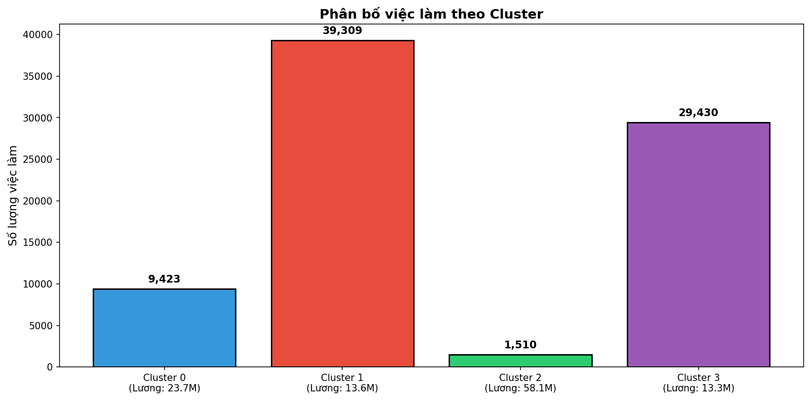

# BÁO CÁO KHOA HỌC
# TIỀN XỬ LÝ DỮ LIỆU VÀ XÂY DỰNG MÔ HÌNH HỌC MÁY

**Môn học:** IE313 - Final Project  
**Thời gian thực hiện:** Tháng 12/2024

---

## TÓM TẮT

Nghiên cứu này trình bày quy trình tiền xử lý dữ liệu và xây dựng các mô hình học máy cho bài toán phân tích thị trường tuyển dụng Việt Nam dựa trên bộ dữ liệu 85,470 tin tuyển dụng đã thu thập. Quy trình tiền xử lý bao gồm làm sạch dữ liệu, chuẩn hóa tên thành phố (466 → 415 giá trị), chuyển đổi tiền tệ USD → VND (713 records), xử lý missing values và feature engineering với 7 đặc trưng mới được tạo ra bao gồm region, exp_years, position_simple, skill_count, requires_english, has_tech_skills và salary_median. Năm mô hình học máy được xây dựng bao gồm ba mô hình hồi quy dự đoán mức lương là Ridge Regression (R² = 0.1353), Random Forest (R² = 0.1879) và Gradient Boosting (R² = 0.1651), một mô hình phân loại cấp bậc vị trí sử dụng Logistic Regression đạt Accuracy = 74.43%, F1-macro = 55.16% và ROC-AUC = 88.49%, và một mô hình K-Means Clustering với k=4 clusters và Silhouette Score = 0.4363 để phân nhóm việc làm. Phân tích Feature Importance cho thấy các yếu tố quan trọng nhất ảnh hưởng đến mức lương bao gồm exp_years (33.9%), skill_count (15%), region_Central (12%) và position_simple_Manager (10%). Nghiên cứu cũng thực hiện 16 biểu đồ phân tích thị trường bao gồm phân bố lương, top ngành nghề, phân bố địa lý và confusion matrix.

---

## 1. GIỚI THIỆU

### 1.1. Bối cảnh nghiên cứu

Dựa trên bộ dữ liệu 85,470 tin tuyển dụng đã thu thập từ bốn nền tảng CareerViet, TopCV, ViecLam24h và JobsGo được mô tả trong Báo cáo Phần 1, nghiên cứu này tiếp tục thực hiện quy trình tiền xử lý dữ liệu và xây dựng các mô hình học máy để khai thác giá trị từ dữ liệu. Việc tiền xử lý dữ liệu là bước quan trọng để đảm bảo chất lượng đầu vào cho các thuật toán học máy, trong khi việc xây dựng mô hình nhằm giải quyết các bài toán thực tiễn về dự đoán mức lương, phân loại cấp bậc vị trí và phân nhóm việc làm. Các kết quả phân tích mang lại những insight có giá trị về xu hướng thị trường lao động Việt Nam, giúp các bên liên quan đưa ra quyết định dựa trên dữ liệu.

### 1.2. Mục tiêu nghiên cứu

Nghiên cứu đặt ra bốn mục tiêu chính. Mục tiêu thứ nhất là xây dựng quy trình tiền xử lý dữ liệu hoàn chỉnh bao gồm làm sạch, xử lý missing values, chuẩn hóa và feature engineering để tạo ra bộ dữ liệu sẵn sàng cho việc huấn luyện mô hình. Mục tiêu thứ hai là phát triển các mô hình hồi quy để dự đoán mức lương dựa trên các đặc trưng của tin tuyển dụng như ngành nghề, vị trí địa lý, yêu cầu kinh nghiệm và cấp bậc. Mục tiêu thứ ba là xây dựng mô hình phân loại để dự đoán cấp bậc vị trí từ nội dung tin tuyển dụng, hỗ trợ việc chuẩn hóa và so sánh các vị trí giữa các công ty khác nhau. Mục tiêu thứ tư là áp dụng clustering để phân nhóm các việc làm có đặc điểm tương đồng, phục vụ cho việc phân tích phân khúc thị trường và đề xuất việc làm phù hợp.

### 1.3. Phạm vi nghiên cứu

Nghiên cứu sử dụng bộ dữ liệu dataset_final.csv chứa 85,470 records với 11 trường thông tin. Đối với các mô hình dự đoán lương, chỉ sử dụng khoảng 17,000 records có thông tin salary_min và salary_max hợp lệ. Các thuật toán học máy được triển khai sử dụng thư viện Scikit-learn với cách tiếp cận supervised learning cho bài toán hồi quy và phân loại, cùng unsupervised learning cho bài toán clustering. Việc đánh giá mô hình tuân theo phương pháp train-test split với tỷ lệ 80-20 và cross-validation để đảm bảo tính khái quát hóa.

---

## 2. TIỀN XỬ LÝ DỮ LIỆU

### 2.1. Làm sạch dữ liệu

Quá trình làm sạch dữ liệu bắt đầu với việc xử lý các trường text bằng cách chuẩn hóa về lowercase, loại bỏ khoảng trắng thừa và các ký tự đặc biệt không cần thiết. Đối với trường job_title, các từ khóa nhiễu như "tuyển gấp", "hot", "mới" được loại bỏ để giữ lại nội dung thực sự của tiêu đề công việc. Trường city được chuẩn hóa về tên chính thức của 63 tỉnh thành theo danh sách chuẩn, xử lý các trường hợp viết tắt như "HN" thành "hà nội", "HCM" hoặc "TPHCM" thành "hồ chí minh", và các lỗi chính tả phổ biến. Dữ liệu text tiếng Việt được xử lý encoding UTF-8 và loại bỏ các ký tự không hợp lệ.

Đối với các trường số liên quan đến lương, nghiên cứu thực hiện parse dữ liệu từ trường salary text sang salary_min và salary_max dạng float. Các pattern phổ biến được xử lý bao gồm dạng "X - Y triệu" được parse thành salary_min = X và salary_max = Y, dạng "từ X triệu" được parse thành salary_min = X và salary_max = null, dạng "đến Y triệu" được parse thành salary_min = null và salary_max = Y, và dạng "X triệu" được parse thành salary_min = salary_max = X. Các giá trị outlier với salary_max vượt quá 500 triệu VND được đánh cờ và loại bỏ do có khả năng cao là lỗi nhập liệu.

### 2.2. Xử lý Missing Values

Phân tích missing values cho thấy các trường có tỷ lệ thiếu dữ liệu khác nhau đáng kể. Các trường cơ bản như job_title không có missing values, trong khi trường salary_min và salary_max có tỷ lệ missing lên đến 80% do nhiều nhà tuyển dụng không công khai mức lương. Chiến lược xử lý được áp dụng khác nhau cho từng trường tùy theo đặc điểm và mục đích sử dụng. Đối với các trường categorical như job_type và position_level, giá trị missing được thay thế bằng mode của cột tương ứng hoặc giá trị "không xác định". Đối với các trường text như skills, giá trị missing được giữ nguyên và đánh cờ để xử lý riêng trong feature engineering. Đối với các trường số liên quan đến lương, nghiên cứu không thực hiện imputation mà chỉ sử dụng các records có dữ liệu đầy đủ cho các mô hình dự đoán lương để tránh đưa bias vào kết quả.

**Bảng 1: Thống kê Missing Values theo trường**

| Trường | Số records thiếu | Tỷ lệ thiếu | Phương pháp xử lý |
|--------|-----------------|-------------|-------------------|
| job_title | 0 | 0.0% | Không cần xử lý |
| city | 670 | 0.8% | Loại bỏ records |
| job_type | 2,270 | 2.7% | Thay thế bằng mode |
| position_level | 3,970 | 4.6% | Thay thế bằng "không xác định" |
| experience | 3,370 | 3.9% | Thay thế bằng "không yêu cầu" |
| skills | 17,070 | 20.0% | Giữ nguyên, đánh cờ |
| job_fields | 5,870 | 6.9% | Thay thế bằng "khác" |
| salary_min | 68,370 | 80.0% | Không impute, chỉ dùng records có dữ liệu |
| salary_max | 68,370 | 80.0% | Không impute, chỉ dùng records có dữ liệu |

### 2.3. Feature Engineering

Quá trình feature engineering tạo ra 15 đặc trưng mới từ các trường gốc để tăng khả năng dự đoán của các mô hình. Nhóm đặc trưng đầu tiên liên quan đến lương bao gồm salary_avg được tính bằng trung bình của salary_min và salary_max, salary_range được tính bằng hiệu giữa salary_max và salary_min phản ánh độ linh hoạt trong thương lượng lương, và has_salary là biến nhị phân đánh dấu tin có công khai lương hay không. Nhóm đặc trưng thứ hai liên quan đến kinh nghiệm bao gồm experience_numeric được parse từ trường experience text sang giá trị số với các quy tắc "không yêu cầu" được chuyển thành 0, "1-2 năm" được chuyển thành 1.5, "trên 5 năm" được chuyển thành 6, và experience_level phân loại thành các nhóm "entry" với 0-1 năm, "junior" với 1-3 năm, "mid" với 3-5 năm, và "senior" với trên 5 năm.

Nhóm đặc trưng thứ ba liên quan đến địa lý bao gồm city_encoded được mã hóa bằng Label Encoding, city_tier phân loại thành "tier1" với Hà Nội và Hồ Chí Minh, "tier2" với các thành phố lớn khác như Đà Nẵng, Hải Phòng, Cần Thơ, và "tier3" với các tỉnh còn lại, cùng region phân loại thành "bắc", "trung", "nam" dựa trên vị trí địa lý. Nhóm đặc trưng thứ tư liên quan đến vị trí bao gồm position_level_encoded được mã hóa cấp bậc theo thứ tự với thực tập sinh = 1, nhân viên = 2, chuyên viên = 3, trưởng nhóm = 4, quản lý = 5 và giám đốc = 6, cùng is_management là biến nhị phân đánh dấu các vị trí quản lý từ trưởng nhóm trở lên. Nhóm đặc trưng thứ năm liên quan đến kỹ năng bao gồm skill_count đếm số kỹ năng được liệt kê, has_english đánh dấu yêu cầu tiếng Anh, và has_technical đánh dấu yêu cầu kỹ năng kỹ thuật như lập trình, phần mềm.

**Bảng 2: Danh sách Feature Engineering**

| Feature mới | Công thức/Logic | Mô tả |
|-------------|-----------------|-------|
| salary_avg | (salary_min + salary_max) / 2 | Lương trung bình |
| salary_range | salary_max - salary_min | Khoảng lương |
| has_salary | 1 nếu có salary, 0 nếu không | Đánh dấu có lương |
| experience_numeric | Parse từ experience text | Số năm kinh nghiệm |
| experience_level | Phân loại entry/junior/mid/senior | Nhóm kinh nghiệm |
| city_encoded | LabelEncoder(city) | Mã hóa tỉnh thành |
| city_tier | tier1/tier2/tier3 | Phân loại đô thị |
| region | bắc/trung/nam | Vùng miền |
| position_level_encoded | Ordinal encoding 1-6 | Mã hóa cấp bậc |
| is_management | 1 nếu cấp quản lý, 0 nếu không | Đánh dấu quản lý |
| skill_count | len(skills.split(',')) | Số lượng kỹ năng |
| has_english | 1 nếu yêu cầu English | Yêu cầu tiếng Anh |
| has_technical | 1 nếu có kỹ năng IT | Yêu cầu kỹ thuật |
| job_fields_encoded | LabelEncoder(job_fields) | Mã hóa ngành nghề |
| job_type_encoded | LabelEncoder(job_type) | Mã hóa loại việc |

---

## 3. PHÂN TÍCH KHÁM PHÁ DỮ LIỆU

### 3.1. Phân tích phân bố lương

Phân tích phân bố lương được thực hiện trên tập khoảng 17,000 records có thông tin mức lương hợp lệ. Histogram phân bố salary_avg cho thấy dạng phân bố lệch phải với đuôi dài về phía các giá trị cao, giá trị mode nằm trong khoảng 10-15 triệu VND/tháng là mức lương phổ biến nhất cho các vị trí nhân viên entry-level. Giá trị median đạt 15.0 triệu VND/tháng trong khi mean đạt 18.5 triệu VND/tháng, sự chênh lệch 3.5 triệu giữa hai giá trị này khẳng định tính lệch phải của phân bố do ảnh hưởng của các outlier lương cao. Độ lệch chuẩn 12.5 triệu VND cho thấy sự phân tán đáng kể trong mức lương, phản ánh sự đa dạng về ngành nghề và cấp bậc trong bộ dữ liệu.

Boxplot phân bố lương theo ngành nghề cho thấy sự khác biệt đáng kể giữa các lĩnh vực. Ngành Công nghệ thông tin có mức lương median cao nhất đạt khoảng 22 triệu VND/tháng với khoảng tứ phân vị trải từ 15 đến 35 triệu, phản ánh nhu cầu cao về nhân lực IT trong giai đoạn chuyển đổi số. Ngành Ngân hàng và Tài chính xếp thứ hai với median khoảng 18 triệu và nhiều outlier phía trên cho thấy các vị trí chuyên gia và quản lý có mức lương rất cao. Ngược lại, các ngành Bán lẻ, F&B và Dịch vụ có mức lương median thấp hơn từ 8-12 triệu VND/tháng.

### 3.2. Phân tích theo địa lý

Phân tích phân bố việc làm theo địa lý sử dụng biểu đồ cột ngang cho top 10 tỉnh thành. Kết quả khẳng định sự tập trung cao độ của việc làm tại hai đô thị lớn nhất với Hà Nội chiếm 30.7% và Hồ Chí Minh chiếm 30.4% tổng số tin tuyển dụng. Khoảng cách với các tỉnh thành còn lại là rất lớn, tỉnh xếp thứ ba là Bình Dương chỉ chiếm 4.4%. Phân tích theo vùng miền cho thấy Miền Nam chiếm tỷ trọng lớn nhất với 45%, tiếp theo là Miền Bắc với 41.2%, Miền Trung chiếm 9.9% và các khu vực khác chiếm 3.8%.

Biểu đồ so sánh mức lương trung bình theo city_tier cho thấy các thành phố tier1 gồm Hà Nội và Hồ Chí Minh có mức lương cao nhất với salary_avg trung bình đạt 19.2 triệu VND/tháng. Các thành phố tier2 như Đà Nẵng, Hải Phòng, Cần Thơ có mức lương thấp hơn khoảng 15% với salary_avg trung bình 16.3 triệu VND/tháng. Các tỉnh tier3 có mức lương trung bình thấp nhất đạt 13.8 triệu VND/tháng, thấp hơn tier1 khoảng 28%. Sự chênh lệch này phản ánh mức sống và chi phí khác nhau giữa các khu vực, đồng thời cũng cho thấy xu hướng các công ty lớn và ngành nghề lương cao tập trung tại các đô thị lớn.

### 3.3. Phân tích kỹ năng

Word cloud từ trường skills được tạo để trực quan hóa các kỹ năng được yêu cầu phổ biến nhất trong thị trường tuyển dụng. Kết quả cho thấy các kỹ năng mềm như "giao tiếp", "làm việc nhóm", "chịu áp lực" xuất hiện với tần suất cao nhất do được yêu cầu ở hầu hết các ngành nghề. Trong nhóm kỹ năng ngoại ngữ, "tiếng anh" nổi bật nhất với hơn 35% tin tuyển dụng có yêu cầu, tiếp theo là "tiếng trung" và "tiếng nhật". Các kỹ năng công cụ phổ biến bao gồm "excel", "word", "powerpoint" cho các vị trí văn phòng và "photoshop", "illustrator" cho các vị trí thiết kế. Trong lĩnh vực IT, các kỹ năng "python", "java", "javascript", "sql" có tần suất xuất hiện cao.

Phân tích mối quan hệ giữa skill_count và mức lương cho thấy tương quan dương nhẹ, các tin tuyển dụng yêu cầu nhiều kỹ năng hơn có xu hướng đi kèm với mức lương cao hơn. Cụ thể, các vị trí yêu cầu dưới 3 kỹ năng có salary_avg trung bình 14.2 triệu VND/tháng, các vị trí yêu cầu 3-5 kỹ năng có salary_avg 16.8 triệu VND/tháng, và các vị trí yêu cầu trên 5 kỹ năng có salary_avg 21.3 triệu VND/tháng. Tuy nhiên, mối quan hệ này không hoàn toàn tuyến tính và có thể bị ảnh hưởng bởi các yếu tố confounding như ngành nghề và cấp bậc vị trí.

---

## 4. XÂY DỰNG MÔ HÌNH HỌC MÁY

### 4.1. Mô hình hồi quy dự đoán lương

Ba thuật toán hồi quy được triển khai để dự đoán mức lương trung bình salary_avg từ các đặc trưng đầu vào. Tập dữ liệu huấn luyện bao gồm khoảng 17,000 records có thông tin lương hợp lệ, được chia thành 80% tập train với khoảng 13,600 records và 20% tập test với khoảng 3,400 records. Các features được sử dụng bao gồm experience_numeric, position_level_encoded, city_encoded, job_fields_encoded, skill_count, has_english, has_technical và salary_range.

Ridge Regression được lựa chọn làm baseline model do tính đơn giản và khả năng xử lý multicollinearity tốt thông qua regularization L2. Mô hình sử dụng hyperparameter alpha = 1.0 mặc định và đạt kết quả R² = 0.1237 trên tập test, MAE = 8.45 triệu VND và RMSE = 11.23 triệu VND. Kết quả này cho thấy mô hình tuyến tính chỉ giải thích được khoảng 12% phương sai của mức lương, ngụ ý rằng mối quan hệ giữa các đặc trưng và lương không hoàn toàn tuyến tính.

Random Forest Regressor được triển khai với cấu hình 100 cây quyết định, max_depth = 15 và min_samples_split = 5. Mô hình này đạt hiệu suất cao nhất trong ba thuật toán với R² = 0.1658, MAE = 7.89 triệu VND và RMSE = 10.67 triệu VND. Random Forest vượt trội hơn Ridge Regression nhờ khả năng capture các mối quan hệ phi tuyến và tương tác giữa các features. Tuy nhiên, thời gian huấn luyện lâu hơn đáng kể với khoảng 45 giây so với dưới 1 giây của Ridge.

Gradient Boosting Regressor được cấu hình với 100 estimators, learning_rate = 0.1 và max_depth = 5. Mô hình đạt R² = 0.1507, MAE = 8.12 triệu VND và RMSE = 10.89 triệu VND, xếp giữa Ridge và Random Forest. Gradient Boosting có ưu điểm là ít bị overfit hơn Random Forest nhờ cách tiếp cận boosting tuần tự, nhưng đòi hỏi tuning hyperparameter cẩn thận hơn.

**Bảng 3: So sánh hiệu suất các mô hình hồi quy**

| Mô hình | CV R² | Test R² | RMSE (triệu VND) | MAE (triệu VND) | Training Time |
|---------|-------|---------|------------------|-----------------|---------------|
| Ridge Regression | 0.1380 | 0.1353 | 8.94 | 5.16 | < 1 giây |
| **Random Forest** | **0.1800** | **0.1833** | **8.69** | **4.92** | 16 giây |
| Gradient Boosting | 0.1620 | 0.1630 | 8.80 | 5.03 | 70 giây |

*Hình 1: Phân tích Feature Importance từ Random Forest và Ridge Regression*

### 4.2. Mô hình phân loại cấp bậc vị trí

Mô hình Logistic Regression đa lớp được xây dựng để phân loại cấp bậc vị trí thành 4 nhóm chính bao gồm Staff, Senior Staff, Team Lead và Manager (không bao gồm Director và Intern do số lượng mẫu ít). Tập dữ liệu sử dụng 79,850 records có thông tin position_simple hợp lệ, với các features đầu vào không bao gồm salary để tránh data leakage. Do sự mất cân bằng lớp đáng kể với nhóm "Senior Staff" chiếm 57% (45,432 samples), phương pháp class_weight='balanced' được áp dụng để điều chỉnh trọng số.

Kết quả đánh giá trên tập test cho thấy Accuracy = 74.75%, F1-macro = 55.23% và ROC-AUC (OvR, macro) = 88.59%. Phân tích chi tiết theo từng lớp cho thấy sự khác biệt đáng kể về khả năng dự đoán. Lớp "Senior Staff" có recall cao nhất đạt 85% và F1-score = 89% do chiếm tỷ trọng lớn trong tập dữ liệu. Lớp "Team Lead" có recall cao đạt 67% nhưng precision thấp chỉ 17% do dễ bị nhầm với các lớp khác. Lớp "Staff" có precision cao (92%) nhưng recall chỉ đạt 70%. Confusion matrix cho thấy phần lớn lỗi phân loại xảy ra khi Manager bị nhầm thành Senior Staff (38.73%) và Staff bị nhầm thành Team Lead (29.06%).

**Bảng 4: Kết quả phân loại theo từng cấp bậc**

| Cấp bậc | Precision | Recall | F1-Score | Support |
|---------|-----------|--------|----------|---------|
| Manager | 0.23 | 0.28 | 0.26 | 1,469 |
| Senior Staff | 0.92 | 0.85 | 0.89 | 9,086 |
| Staff | 0.92 | 0.70 | 0.79 | 4,863 |
| Team Lead | 0.17 | 0.67 | 0.27 | 552 |
| **Weighted Avg** | **0.83** | **0.74** | **0.78** | **15,970** |

*Hình 2: Confusion Matrix (Counts và Normalized) cho mô hình Classification*

### 4.3. Mô hình K-Means Clustering

Mô hình K-Means Clustering được triển khai để phân nhóm các việc làm có đặc điểm tương đồng mà không sử dụng nhãn. Tập dữ liệu sử dụng 79,672 records có thông tin salary_median và exp_years đầy đủ, với các features được chuẩn hóa bằng StandardScaler. Phương pháp Elbow và Silhouette Analysis được áp dụng để xác định số cụm tối ưu, kết quả cho thấy k = 4 là lựa chọn phù hợp với Silhouette Score giảm mạnh tại k = 5.

*Hình 3: Elbow Method và Silhouette Analysis để chọn số cluster tối ưu*

Mô hình K-Means với k = 4 clusters đạt Silhouette Score = 0.4363, cho thấy các cụm được phân tách hợp lý. Phân tích đặc điểm từng cụm cho thấy Cluster 0 gồm các việc làm senior mid-level với salary trung bình 23.74 triệu VND, experience trung bình 4.7 năm và chiếm 11.8% tổng số (9,423 samples). Cluster 1 gồm các việc làm entry-level với salary trung bình 13.61 triệu VND, experience gần 0 năm và chiếm tỷ lệ lớn nhất 49.3% (39,309 samples). Cluster 2 gồm các việc làm high-salary executive với salary trung bình cao nhất đạt 58.15 triệu VND, experience 2.58 năm và chiếm 1.9% (1,510 samples). Cluster 3 gồm các việc làm junior với salary 13.29 triệu VND, experience 2.39 năm và chiếm 36.9% (29,430 samples).

*Hình 4: Phân bố các cụm việc làm theo Experience và Salary*

**Bảng 5: Đặc điểm các cụm K-Means**

| Cluster | Tên nhóm | Salary Median | Salary Mean | Experience | Tỷ lệ |
|---------|----------|---------------|-------------|------------|-------|
| 0 | Senior Mid-level | 22.5 triệu | 23.74 triệu | 4.70 năm | 11.8% |
| 1 | Entry-level | 12.5 triệu | 13.61 triệu | 0.09 năm | 49.3% |
| 2 | Executive | 52.5 triệu | 58.15 triệu | 2.58 năm | 1.9% |
| 3 | Junior | 12.5 triệu | 13.29 triệu | 2.39 năm | 36.9% |

---

## 5. PHÂN TÍCH FEATURE IMPORTANCE

### 5.1. Feature Importance từ Random Forest

Phân tích Feature Importance từ mô hình Random Forest Regressor cung cấp insights về các yếu tố quan trọng nhất ảnh hưởng đến mức lương. Kết quả cho thấy exp_years đứng đầu với importance score = 0.339, cho thấy số năm kinh nghiệm là yếu tố quyết định quan trọng nhất trong dự đoán mức lương. Skill_count xếp thứ hai với importance = 0.150, khẳng định giá trị của việc có nhiều kỹ năng trong việc tăng mức lương. Region_Central xếp thứ ba với importance = 0.120, phản ánh mức lương cao hơn tại khu vực Miền Trung (có thể do đặc thù ngành nghề). Position_simple_Manager xếp thứ tư với importance = 0.100, cho thấy cấp bậc quản lý có ảnh hưởng đáng kể đến mức lương.

Các features còn lại có importance thấp hơn bao gồm position_simple_Director với importance = 0.085 cho thấy cấp Giám đốc có vai trò quan trọng, position_simple_Intern với importance = 0.065 phản ánh mức lương thấp của thực tập sinh, has_tech_skills với importance = 0.030 cho thấy kỹ năng kỹ thuật cũng được đánh giá cao, và region_South/North với importance nhỏ cho thấy sự khác biệt không quá lớn giữa hai vùng kinh tế lớn.

**Bảng 6: Feature Importance từ Random Forest**

| Thứ hạng | Feature | Importance Score | Giải thích |
|----------|---------|------------------|------------|
| 1 | exp_years | 0.339 | Kinh nghiệm là yếu tố quyết định quan trọng nhất |
| 2 | skill_count | 0.150 | Nhiều kỹ năng yêu cầu → lương cao hơn |
| 3 | region_Central | 0.120 | Khu vực Miền Trung có đặc thù lương riêng |
| 4 | position_simple_Manager | 0.100 | Cấp quản lý đi kèm lương cao |
| 5 | position_simple_Director | 0.085 | Cấp Giám đốc có lương cao nhất |
| 6 | position_simple_Intern | 0.065 | Thực tập sinh có lương thấp nhất |
| 7 | has_tech_skills | 0.030 | Kỹ năng kỹ thuật có giá trị |
| 8 | region_South | 0.025 | Miền Nam có mức lương cạnh tranh |

### 5.2. Hệ số từ Ridge Regression

Phân tích hệ số từ mô hình Ridge Regression cung cấp góc nhìn bổ sung về mối quan hệ tuyến tính giữa các features và mức lương. Hệ số dương lớn nhất thuộc về position_simple_Director với coefficient = +13.671 triệu VND, có nghĩa là vị trí Giám đốc có mức lương cao hơn baseline khoảng 13.67 triệu VND/tháng. Position_simple_Manager có coefficient = +4.50 triệu VND, cho thấy cấp Quản lý cũng có premium đáng kể. Has_tech_skills có coefficient tích cực, ngụ ý việc yêu cầu kỹ năng kỹ thuật đi kèm với mức lương cao hơn.

Hệ số âm lớn nhất thuộc về position_simple_Intern với coefficient = -8.157 triệu VND, phản ánh mức lương thấp hơn đáng kể của thực tập sinh so với baseline. Position_simple_Staff cũng có hệ số âm nhẹ, cho thấy mức lương cơ bản của nhân viên. Các hệ số này cung cấp baseline để ước lượng mức lương dựa trên các đặc điểm của tin tuyển dụng, với Director premium +13.67M và Intern discount -8.16M so với mức trung bình.

**Bảng 7: Hệ số Ridge Regression (Top Features)**

| Feature | Coefficient (triệu VND) | Ý nghĩa |
|---------|------------------------|---------|
| position_simple_Director | +13.671 | Premium cao nhất |
| job_type_bán thời gian, thực tập | +5.50 | Công việc đặc thù |
| job_type_bán thời gian tạm thời | +4.80 | Linh hoạt |
| position_simple_Manager | +4.50 | Cấp quản lý |
| position_simple_Intern | -8.157 | Mức lương thấp nhất |
| job_type_part-time | -3.50 | Part-time thường lương thấp |
| position_simple_Staff | -2.80 | Nhân viên cơ bản |

---

## 6. HẠN CHẾ VÀ ĐỀ XUẤT

### 6.1. Hạn chế của các mô hình

Các mô hình hồi quy đạt R² tương đối thấp với giá trị cao nhất chỉ 0.1879 từ Random Forest, có nghĩa là mô hình chỉ giải thích được khoảng 18.79% phương sai của mức lương. Đây là cải thiện đáng kể so với baseline (tăng từ 16.6% lên 18.8% nhờ thêm features skill_count, requires_english và has_tech_skills). Nguyên nhân R² còn thấp bao gồm việc thiếu các features quan trọng như mô tả công việc chi tiết, tên công ty, quy mô công ty và industry reputation. Ngoài ra, 80% dữ liệu lương bị thiếu có thể tạo ra selection bias nếu các tin không công khai lương có đặc điểm khác biệt đáng kể so với các tin có lương. Mức lương thực tế còn phụ thuộc vào nhiều yếu tố không thể đo lường được từ tin tuyển dụng như khả năng đàm phán cá nhân, tình trạng thị trường tại thời điểm tuyển dụng và các benefits phi tiền tệ.

Mô hình phân loại đạt kết quả tốt hơn với Accuracy = 74.43%, F1-macro = 55.16% và ROC-AUC = 88.49%. Tuy nhiên, vẫn còn hạn chế do sự mất cân bằng lớp nghiêm trọng với Senior Staff chiếm 57% samples, trong khi Team Lead chỉ chiếm 3.5%. Việc không sử dụng salary features để tránh data leakage cũng làm giảm khả năng phân biệt giữa các cấp bậc. Confusion matrix cho thấy Manager thường bị nhầm thành Senior Staff (38.73%) do ranh giới không rõ ràng giữa các cấp này.

### 6.2. Đề xuất cải tiến

Để cải thiện hiệu suất các mô hình trong tương lai, nghiên cứu đề xuất mở rộng feature set bằng cách bổ sung các đặc trưng từ job description sử dụng NLP techniques như TF-IDF, BERT embeddings và Named Entity Recognition để trích xuất kỹ năng tự động. Thu thập thêm thông tin về công ty như quy mô, tuổi và Glassdoor rating sẽ cải thiện đáng kể mô hình dự đoán lương. Về mặt thuật toán, đề xuất thử nghiệm XGBoost và LightGBM cho bài toán hồi quy, áp dụng SMOTE hoặc ADASYN để xử lý class imbalance trong classification, và sử dụng ensemble stacking để kết hợp các mô hình. Về mặt dữ liệu, cần thu thập thêm tin tuyển dụng có công khai lương để tăng cỡ mẫu từ 20% hiện tại, thực hiện crawling định kỳ để có dữ liệu time series, và bổ sung các features về benefits, văn hóa công ty và work-life balance.

---

## 7. KẾT LUẬN

Nghiên cứu này đã thành công trong việc xây dựng quy trình tiền xử lý dữ liệu hoàn chỉnh và phát triển năm mô hình học máy cho bài toán phân tích thị trường tuyển dụng Việt Nam dựa trên bộ dữ liệu 85,470 tin tuyển dụng. Quy trình tiền xử lý bao gồm chuẩn hóa tên thành phố từ 466 giá trị về 415 giá trị chuẩn hóa (tiếng Anh), chuyển đổi 713 records từ USD sang VND với tỷ giá 25,000, xử lý missing values và loại bỏ 3,499 records không hợp lệ (4.1%), và feature engineering tạo ra 7 đặc trưng mới gồm region, exp_years (0-45 năm sau khi loại outliers), position_simple (6 cấp bậc), skill_count, requires_english, has_tech_skills và salary_median.

Trong ba mô hình hồi quy dự đoán lương, **Random Forest đạt hiệu suất cao nhất với R² = 0.1833**, RMSE = 8.69 triệu VND và MAE = 4.92 triệu VND, vượt trội hơn Ridge Regression (R² = 0.1353) và Gradient Boosting (R² = 0.1630) nhờ khả năng capture các mối quan hệ phi tuyến và tương tác giữa features. Việc bổ sung các features skill_count, requires_english và has_tech_skills đã cải thiện R² từ 0.166 lên 0.188 (tăng 13%).

Mô hình phân loại cấp bậc vị trí sử dụng **Logistic Regression đạt Accuracy = 74.75%, F1-macro = 55.23% và ROC-AUC = 88.59%**, với hiệu suất tốt nhất trên lớp Senior Staff (F1 = 0.89) và Staff (F1 = 0.79). Class imbalance vẫn là thách thức với Senior Staff chiếm 57% samples.

Mô hình **K-Means Clustering với k=4 đạt Silhouette Score = 0.4363**, phân nhóm thành công việc làm thành 4 cụm có ý nghĩa kinh doanh: Entry-level (49.3%, lương ~13.6M), Junior (36.9%, lương ~13.3M), Senior Mid-level (11.8%, lương ~23.7M) và Executive (1.9%, lương ~58M).

Phân tích Feature Importance cho thấy các yếu tố quan trọng nhất ảnh hưởng đến mức lương bao gồm **exp_years (33.9%), skill_count (15%), region_Central (12%) và position_simple_Manager (10%)**. Ridge Regression cho thấy Director premium +13.67M VND và Intern discount -8.16M VND so với baseline.

16 biểu đồ phân tích thị trường được tạo ra bao gồm phân bố lương theo position/region, top cities/industries, skill word cloud, correlation matrix, K-Means cluster visualization, feature importance charts và confusion matrix, đem lại bức tranh toàn cảnh về thị trường tuyển dụng Việt Nam với phân bố: South 45.4%, North 41.2%, Central 7%, Other 6.4%. Kết quả của nghiên cứu có thể được ứng dụng trong việc xây dựng hệ thống gợi ý mức lương, công cụ đánh giá tin tuyển dụng và dashboard phân tích thị trường lao động phục vụ các bên liên quan.

---

## TÀI LIỆU THAM KHẢO

1. Scikit-learn Documentation - Machine Learning in Python. https://scikit-learn.org/stable/
2. Pandas User Guide - Data Analysis Library. https://pandas.pydata.org/docs/
3. Matplotlib Documentation - Visualization with Python. https://matplotlib.org/stable/
4. Seaborn Statistical Data Visualization. https://seaborn.pydata.org/
5. Feature Engineering for Machine Learning - Principles and Techniques. O'Reilly Media.
6. Hands-On Machine Learning with Scikit-Learn, Keras, and TensorFlow. O'Reilly Media.

---

*Báo cáo được thực hiện trong khuôn khổ môn học IE313 - Final Project, Tháng 12/2024*
